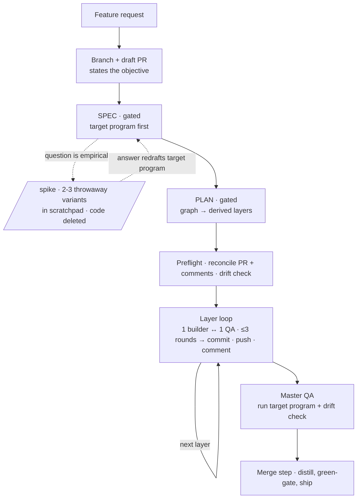

# outputty — Architecture

> The target surface, then its machinery — one place per concept. Mermaid, never SVG.

## What we're building towards

The finished surface — what a user actually types and gets back, end to end (informed by the North
Star; this is the concrete experience, not the goal statement):

```text
> outputty: add CSV export to the report page

SPEC   · one question at a time (business, then technical); you approve the spec.
         First artifact: the "What we're building towards" program for the feature.
PLAN   · task graph written; derived layers previewed with contracts; you approve.
BUILD  · hands-off, starts immediately: one build agent per layer, each spawning its
         own QA; draft PR fills with one plain-language comment per layer
         (what it did · how to call it · gotcha tests) as commits land.
MERGE  · target program runs as acceptance, product.md distilled, PR ready → merged.
```

One command of intent in, one merged PR out — with the PR narrating itself well enough that reviewing
it requires no session context.

## Architecture

**Shape.** A Claude Code plugin with a single-plugin marketplace (`source: "./"`, one
`marketplace.json` in `.claude-plugin/` carrying the plugin entry). Lives at `F:/outputty/claude-plugin`.

**What it stacks on — the platform, and nothing else:**
- **Code intelligence (LSP)** — go-to-definition, find-references, and automatic diagnostics after each
  edit, via Claude Code's own language-server plugins. **Recommended, never required**: it covers 11
  languages and outputty is language-agnostic, so `Grep`/`Glob` remain the floor.
- **Claude Code auto-memory** — durable lessons across sessions. Written at the merge retrospective and
  when the user corrects the agent; surfaced by the `memory-recall` hook before a file it names is edited.
- **outputty** — the flow (spec → plan → build) + product memory (this file) + the laziest-working-diff
  build discipline, owned in-plugin (stated in `protocol.md`, carried by the `outputty-builder` charter;
  absorbed from ponytail — see What was tried — no longer a dependency).

**Flow.** One entry skill (`outputty`) drives three phases, reading a phase file on demand
(progressive disclosure). SPEC and PLAN are gated. SPEC carries an optional **spike** step for a question
that is *empirical, not arguable* (2+ grilling rounds without converging, or a feel/edge-case/does-the-dep-
actually-do-X question): 2–3 throwaway variants built **in the scratchpad** (never the repo — a UI variant
that must run in-app goes on a never-merged branch), the answer redrafts the target program, and the code
is **deleted** — BUILD works from the `contract` + its test, never from spike code. PLAN writes a **task
graph** — a per-branch
`.tasks.jsonl` of tasks with `deps` — and `tasks.js schedule` **derives** the LAYERS from it (no
hand-authored layers; a same-layer scope clash fails loud as a missing dep). For a large or uncertain
deliverable PLAN may **stage** it — a `deps` chain over one scope tagged `prototype → build → sweep`
(the Claude Code archetypes) so the build matures in visible layers; small work stays one task. `stage`
is a label only (it rides the schedule preview + per-layer PR comment; ordering is still the `deps`).
When the design **genuinely forks** (2+ distinct paths the Protocols and the laziest-diff ladder don't
settle), the fork is an empirical question that escaped SPEC — it goes back there as a **spike per
candidate** (SPEC's spike rules: `tmp/`, discarded, the answer redrafts the target program), the user
picks, and the winner seeds the task graph. (Replaced SIMULATE in 0.33.0 — zero dispatches in 4 weeks;
see `lessons.md`.) **BUILD runs as plain subagents dispatched by the
orchestrator** — no dynamic workflow, no `ultracode`. The orchestrator walks the layers in order and
hands each to **two agents in sequence — a builder, then a QA that reviews and repairs**. Nothing nests:
both sit at depth 1, so spawn depth, the version floor, and the silent `Agent`-tool-withheld failure mode
all stop applying. One builder and one QA per layer, in sequence, so each starts with a clean context. **The layer is the unit of work — one builder + one QA
per layer** (not a per-task fan-out; parallelism lives in the dependency graph). One `outputty-builder`
agent builds **all** of the layer's tasks **test-first**: it turns each task's `contract` (the
input/output interface PLAN hands down) into a failing test before writing code, then builds the laziest
diff that makes them all pass — **the test is the definition of done**. Its charter carries the boundary
rules, the laziest-diff discipline (**no defensive coding — let it crash to the top-level handler**), a
**docstring on every function** (when-it-runs + outcome + input→output example), and a self-gate before
handoff (it edits the layer's union scope in the shared checkout). **The builder gets one pass and is
never re-dispatched** — it returns `built`, never a verdict on its own work — and **proving the layer
green is its gate, not QA's discovery**: it runs `CHECKS` for real before handoff and reports the
red→green transition it watched, evidence only it holds. Then a single `outputty-qa`
agent reviews the **whole layer's diff** in a fixed sequence — **tests match specs + docs first**
(each test is real, discriminating, and encodes its `contract`; the suite green as fail-loud
confirmation) → over-engineering (incl. defensive error-swallowing) → docstrings → spec-fit +
**architecture matches product.md's patterns** + dependency direction → any `lenses` PLAN named
(`a11y`/`security`/…). **QA then fixes every finding itself and loops review→fix→re-review inside its own
context** until clean (0.24.0) — the builder never comes back, because handing a diagnosis to a cold
agent means re-deriving the file, the line and the repro that QA already holds. It stops on **no
progress** (a finding surviving two fix attempts) with a hard cap of **5 rounds**, then escalates. The
trade is bounded by a hard fix boundary in its charter: QA repairs **defects in the diff** and may never
move the bar — no weakened assertion, no edited `contract`, no widened scope, no deleted test — so the
cheapest path to green stays closed. Independence survives at both ends: QA's first pass is still a cold
read of code it didn't write, and master QA is still fully independent. One commit agent per layer commits each passed task serially, marks it done, pushes the layer, and
posts a **terse** per-layer PR comment — **mechanical: it no longer runs the program or draws a diagram**
(that per-layer work was the slow ~9-minute step; the one real run and any diagram land once, at master
QA / the final body). A drain loop builds any discovered-from work (originals never re-enter it).
**Model tiered by role** (0.13.5, builder dropped to low in 0.14.1): builder **Sonnet/low** (test-first, so
the failing test constrains it), per-layer QA **Sonnet/xhigh** (the
judgment-heavy safety net thinks hard), master QA **Opus** (strongest model for the final whole-build gate,
runs once), commit + preflight **Haiku/medium** (mechanical git + a terse comment). **No Haiku for code or
review** (it drifted on real implementation); **no Opus *rebuild*** — a layer QA cannot drive green on
concrete findings is a plan problem for a human, not a model step-up (the posture ladder + Opus *step-back*
were dropped in 0.12.0; Opus only ever *reviews* at master QA, never rebuilds). There is no per-task model knob. A builder that hits a **scope or API wall** returns a structured
`{ blocked, reason, neededScope?, evidence }` instead of silently substituting a deliverable — blocked
skips the loop and escalates immediately (cheap) for a scope amendment. After the graph drains, **`outputty-master-qa`** (chartered Opus/xhigh, **read-only** — the last
reviewer who touched nothing, which matters now that per-layer QA writes code) runs the target program
once (the whole surface's one real run), judges the whole diff against product.md's **North Star,
roadmap and Architecture** rather than code craft, and writes **the handover**: what happened, which
roadmap item moved, and whether this work still belongs in the project. A layer QA returns `unmet` on escalates to the user **in a fixed shape**: the flow
change as a graph (terminal CLI → ASCII, Claude Desktop → Mermaid), then expected outcome → what was
attempted (per round) → what still fails → 2–4 options with a recommendation. Because the orchestrator stays in the loop it **can** pause —
a failure surfaces when it happens rather than as one terminal verdict, and no keyword or launch-approval
card gates the start. **Model and effort are pinned in each agent's frontmatter** (`model` + `effort`),
not at the call site, so the tier survives without a script re-stating it every run.

The flow at a glance (Mermaid — product.md is agent-consumed, so diagrams here are text, never SVG):



**Protocols** — the seams between the flow's layers. Per seam: the parent supplies inputs, the child
returns outputs; **the child knows nothing about its parent**. PLAN derives task `contract`s from these
(a new seam is a SPEC-gate edit, never invented silently mid-build):

- **skill → phase file**: phase name in context → the phase's instructions (read on demand).
- **PLAN → tasks.js**: a `.tasks.jsonl` graph in → `schedule --json` layers out (cycle/scope-clash = loud failure).
- **orchestrator → build agent**: the layer's tasks (brief + contract each) + union scope + verified `CHECKS` in → `{ change, per-task summaries, residual gaps }` out — or `{ blocked, reason, neededScope?, evidence }` when a done-condition can't be met inside the scope.
- **build agent → its QA agent**: the layer's diff + each task's contract + lenses + the same `CHECKS` in → `{ pass, checks }` out (tests-match-specs+docs first, then code quality).
- **orchestrator → commit agent**: passed tasks + per-task summaries + spec path in → committed scopes, closed ids, pushed layer, one terse PR comment out (no program run, no diagram).
- **session → simulator agent**: requirements + verbatim end state + ONE permutation in → one fixed-schema sim report out (same end state across all siblings).
- **flow → gh**: branch in → draft PR, per-layer comments, ready+merge out.

**Memory boundary (the anti-double-log line):**
- `.claude/product.md` — the six canonical sections (North Star · Status & roadmap · Language · What
  we're building towards · Architecture, seams included · History), per
  `skills/outputty/references/product-template.md`. The SessionStart protocol tells
  the agent to read it at session start (or `bootstrap` reconstructs it if absent). Decisions live
  here **only**.
- Claude Code auto-memory (`~/.claude/projects/<repo>/memory/`) — durable lessons: gotchas,
  preferences, corrections. Never decisions. Machine-local, not committed.
  **Memories name the file they are about**, which is what lets the `memory-recall` hook surface them.
- `.claude/trails/<branch>.md` — the per-branch **spec thought-trail**; distilled into product.md at
  merge, then cold archive. Task breakdown + progress live beside it in `<branch>.tasks.jsonl` (the
  task graph), archived with it.
- `.claude/experts/<slug>.md` (+ `<slug>/` source cache) — per-lens expert **knowledgebase** for
  advanced grilling: footnoted, date-stamped findings an `outputty-expert` re-validates on load
  (disproven priors kept with *why*, never deleted) and refreshes each run, each grounded in the
  **nearest-to-source** evidence (installed source code + official docs over blogs), with every fetched
  source cached alongside so a footnote outlives its URL. Committed (shared, improves across sessions);
  read at panel-composition to reuse experts before inventing.
- `~/.claude/projects/<repo>/memory/` — Claude Code **native auto-memory** (v2.1.59+, agent-writable):
  topic files load on demand via a `MEMORY.md` index that is **itself injected at every session start** —
  keep it bounded, replace-don't-append. The home for a durable lesson the owners above missed: a
  process lesson, a chat-only gotcha or preference, a doc worth re-reading. The merge step's
  **retrospective** (build.md, run before the PR finalizes — and on escalated cycles too, where the
  lessons are richest) routes lessons here and mints a new skill *only* for a proven reusable procedure,
  consulting stored memory + Pocock's standard first (`skills/outputty/references/skill-minting.md`);
  the minted skill lands in `.claude/skills/` and rides the PR. No new memory surface; mirrors Hermes's
  tiering (bounded always-on index vs high-bar skill vs on-demand recall).

**Branch model + GitHub (prescribed).** One feature branch for the whole cycle — the sole exception is a
SPEC **spike** variant that must run inside the app, which gets a throwaway branch that is never merged.
A **draft PR opens
at branch-cut**, before any work, **its body stating the core objective**, so scoping (trail +
product.md diff) and code are reviewed together, and that PR is the **bottom of a stack**: BUILD ships
**one PR per layer** on top of it (`gh stack`) and lands the whole stack **atomically**, so one
unmergeable layer merges none. **`gh stack` is a hard requirement** alongside `gh` — there is no
single-PR fallback, so preflight stops the build before the first layer if it is missing; the **BUILD commit stage** commits each
task serially after its layer passes review (subject = task title, body = the executor's one-line
problem→solution — never verification transcripts or tooling bookkeeping; the builder never commits
into the shared checkout), pushes the layer to the PR, and **posts the build agent's per-layer write-up
verbatim** — the builder authors it on `passed`, because a commit agent re-deriving it from commit
messages and a diff can only guess at intent; the same text is **printed to the terminal between layers**
so a hands-off build stays followable. It is a
mini PR description led by a hidden `<!-- outputty:layer <ids> -->` marker + a layer-named summary
heading, carrying a **snapshot** of the "What we're building towards" program (canonical code, ✅/⏳
annotations per layer, and **input→output as distinct valid-JSON blocks below the code** —
**marked-expected** JSON since no one runs the program until master QA, labelled `Run N` pairs for
multi-run behaviour like SCD2 — never an identical verbatim copy per comment), a top-level DX call
example (only when something real is callable — no placeholders), and gotcha-only test flags, written in
plain language**; the one real run + any diagram land at master QA / the final body. Alongside that
write-up the orchestrator prints a **running session recap** after every layer — three tables (layers and
their state, issues caught with where they were caught and whether they were fixed or deferred, and
what's next) — cumulative so a user dropping in mid-build sees where it stands, and printed under an
escalation too, when it matters most. A deferred issue must name the task id it became: "deferred"
without an id is how work silently disappears. The PR is marked
ready and merged at the end. **Every PR write — draft body, per-layer comment, final description — follows one
canonical spec** (`skills/outputty/references/pr-description.md`, referenced from `protocol.md`), so the
format never drifts across the surfaces that produce it. **Scope splits by surface:** the PR body is the
whole task (all layers); a layer comment is only its own layer. The spec's "how it works" diagram is
drawn with the `diagram` house style (never Mermaid) and **scoped to the change** — a whole new
flow gets a full graph, an added step exactly 5 nodes (summary → before → the step → after → summary), a
flow change a before/after pair. Because a resumed session can inherit a task graph that's ahead of
GitHub, the reconciliation runs as a **preflight before the first layer** (every run, never skipped):
it creates a missing draft PR, pushes unpushed commits, and reconstructs any done layer's missing comment
from its commits + diff (matched by the layer marker) — republishing finished work without rebuilding
it. outputty enforces its tools on **real work, not the
session**: the `require-environment` PreToolUse guard denies file edits outside a git repo
(read-only work is never blocked), while the SessionStart hook **warns** about anything
missing (a GitHub remote, authenticated `gh` — the flow needs those) and
injects `hooks/protocol.md` (the flow + the always-on behavioural rules — verify-by-running, memory
routing, skepticism), which tells the agent to **read `product.md` itself** (or run `bootstrap` if
it's absent) rather than embedding it. It skips injection entirely for subagents (detected via the hook
input's `agent_type`), so only the main session pays for it.

**Brownfield.** `bootstrap` reconstructs `product.md` from existing docs, docstrings, and
(optional) commit messages: the user **multi-selects** which sources to scan, and the cheapest agent
(`scanner`, haiku) does the grunt scan, then it grills only the gaps. It writes product.md only.

**Discovery.** The flow acts on an intent the user brings; `audit` supplies the other half —
*finding* the work worth doing. It's a read-only advisor (adapted from [shadcn/improve](https://github.com/shadcn/improve),
MIT): recon → effort-scaled parallel audit (Explore agents, nine categories in
`skills/audit/references/audit-playbook.md`) → vet → a leverage-ranked findings table plus
separate direction findings. Deliberately **no `plans/` backlog** — outputty keeps one memory surface, so
findings feed **product.md's roadmap** (persistent 📋 items) and the chosen one **seeds the flow's SPEC**;
transient findings are re-found on the next audit (re-auditing *is* the backlog). The playbook doubles as
the review-lens library `outputty-qa` and `qa` read for their category checks.

**Guards (transferred).** A hands-off autonomous build needs deterministic safety rails the platform
doesn't provide: four PreToolUse hooks — `require-environment`,
`block-dangerous-commands`, `scan-secrets`, and `guard-secret-files` — whose specific deny/ask
patterns live in [docs/security.md](docs/security.md). The BUILD QA gate is a single `outputty-qa` agent
per layer (tests-match-specs+docs → over-engineering → docstrings → spec-fit/patterns/dep-direction → any
lenses) plus a final **master-QA** pass over the whole diff vs `product.md`, green-gated at start and
merge, with root-cause-before-retry. Diagrams are an **opt-in**
`diagram` skill — availability, never a mandate. `documentation` holds the README/doc
ruleset (front-load, routing-hub-not-manual, diagram-only-when-earned); the flow updates the README
through it, never by hand. `qa` holds the author's pre-handoff definition-of-done and defers the
enforced PR-description format to the canonical spec (`skills/outputty/references/pr-description.md`,
which carries both the rules and the fill-in skeleton — no `.github/` template, since a plugin install
wouldn't carry one into the consumer repo); it runs an over-engineering
review inline and defers docs to `documentation` rather than restating them. Everything else
stays delegated.
