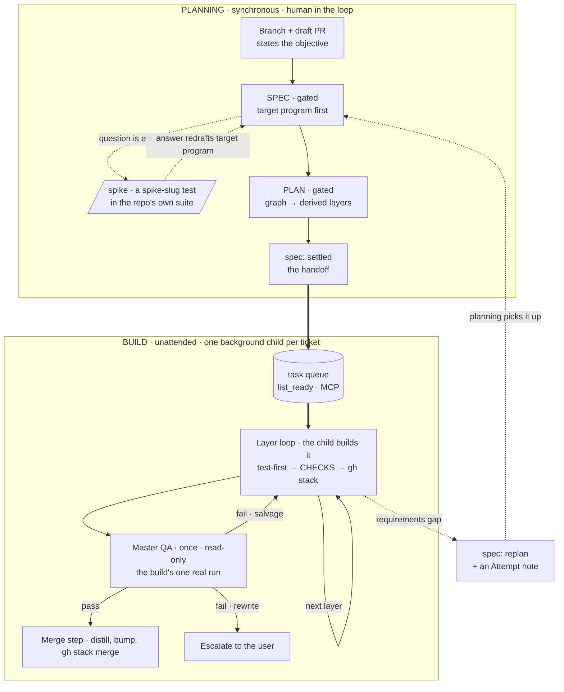

# outputty - Architecture

> The target program, then its machinery: one place per concept.

## What we're building towards

The finished surface, not the goal statement: what a user types and gets back, end to end. Two stages,
joined by the task queue.

Input - one item of intent, typed into a planning session:

```text
outputty: add a CSV export of the synced orders
```

The cycle that runs on it:

```text
PLANNING SESSION  ── one item, you are in the loop
SPEC   · one question at a time (business, then technical); you approve the spec.
         First artifact: the "What we're building towards" program for the feature.
PLAN   · task graph written; derived layers previewed with contracts; you approve.
SETTLE · `spec: settled` on the task. The planning session stops here.

BUILD CHILD  ── unattended, a background agent in its own worktree
BUILD  · this session builds every layer itself, test-first, and ships each layer
         as its own stacked draft PR.
QA     · one read-only master QA over the whole stack, once the graph drains.
         The build's only real run of the target program.
MERGE  · product memory distilled, version bumped, stack merged atomically.
```

Output - one merged stack, expected:

```text
feature/csv-export  #41-#43 merged  (3 layers, master QA pass)
```

One item of intent in, one merged stack out. A PR narrates itself well enough that reviewing it needs no
session context.

## Shape

A Claude Code plugin with a single-plugin marketplace: `source: "./"`, and one `marketplace.json` in
`.claude-plugin/` carrying the plugin entry.

## What it stacks on - the platform, and nothing else

1. **`gh` plus `gh stack`** - the draft PR at branch cut, one stacked PR per layer, and the atomic `gh
   stack merge --yes`. A hard requirement, with no single-PR fallback.
2. **Background agents with worktree isolation** - one unattended child per ticket, each in a
   checkout of its own. It is what makes a dispatcher possible without a multiplexer underneath.
3. **outputty** - the two stages and the queue that joins them (planning: SPEC plus PLAN; build: BUILD plus
   master QA plus merge), product memory (this file), and the laziest-working-diff build discipline. That
   discipline is owned in-plugin as `skills/code-rules/SKILL.md`.

## Flow

Each stage is one skill that carries the whole stage inline: `skills/planning` and `skills/build`. The
dispatch loop is a third, `skills/start`. There are no phase files, so the skill is the entry point.

**PLANNING**, in order:

1. **Branch and draft PR** - conditional. On an item branch in a worktree the branch is already cut, so the
   session states the objective and opens the PR.
2. **SPEC** - grills business goals then technical goals as two distinct passes, and records each settled
   question with `append_trail` before asking the next.
3. **A spike** - answers an empirical question rather than an arguable one. It is a test in the repo's own
   suite named `spike-<slug>`, variants as cases in one file, committed to the branch as written. It
   graduates into the standing re-verification probe for a routed fact, or it is deleted in the same
   session. It runs as a **fork**, inheriting the session's conversation on a shared prompt
   cache. So it costs what it builds, not what it must be told.
4. **A fork-off** - two to four candidates built side by side, each a fork in its own worktree. One
   observable, named before they spawn, decides. A spike per candidate discards every worktree; a
   prototype per candidate adopts the winner's and removes the rest.
5. **PLAN** - writes the task graph into the `tasks` MCP server, tasks with `deps` and `scope`. The
   `schedule` tool derives the layers from that graph. No layer is hand-authored, and a dependency cycle
   fails loud.
6. **Staging a large or uncertain deliverable** - a `deps` chain over one scope, tagged `prototype → build
   → sweep`. That `stage` label rides the schedule preview and the PR comment, and ordering stays the
   `deps`.
7. **A design fork PLAN cannot settle** - back to SPEC, as a spike per candidate.
8. **The handoff** - `spec: settled`, on a ticket that clears the dispatchable bar. Nothing else
   counts as finishing the stage.

The gates stop for the user, in the planning session itself. A gate is never relayed or proxied.

**BUILD** has no agents, and no per-layer QA. The repo's own `CHECKS` is BUILD's early warning, not a
reviewer. Per layer, in order:

1. Re-check the task against the roadmap and the trail. Stale words, already done, or no longer serving the
   roadmap each escalate.
2. Turn each task's `contract` into a failing test.
3. Write the laziest diff to green.
4. Run `CHECKS` for real, and watch the red to green transition.
5. Cut the layer branch off the layer below, before committing.
6. Publish it with `gh stack`.

**Master QA** is the build's only review. At the `subagent` level the `qa` skill runs on
`outputty:outputty-reviewer`, a generic read-only executor. It judges the whole diff against product
memory's North Star, roadmap and architecture rather than against code craft. Its verdict is `pass` (merge
step), `fail`-salvage (`add_task`, build another layer, run it again), or `fail`-rewrite (escalate). A
rewrite is escalated, never attempted: it needs new requirements, and requirements are gated.

**Escalation** is reserved for a blocker that planning cannot answer: a broken environment, a missing
credential, a dependency that does not exist. Nothing merges on an escalation.

The two stages at a glance:



## The seams (protocols)

Per seam the parent supplies inputs and the child returns outputs. The child knows nothing about its
parent. PLAN derives task `contract`s from these seams, and a new seam is a SPEC-gate edit, never invented
mid-build.

1. **`/outputty:init` → the project CLAUDE.md.** In: the block template `skills/init/block.md`, and any
   existing `outputty:begin..end` region. Out: the managed block written between the markers, plus the
   secret-path `permissions` in `.claude/settings.json`.
2. **PLANNING stage → the task queue** (the `tasks` MCP server, GitHub Issues). In: a settled item,
   its trail, its target program, and its task graph. Out: `spec: settled` on tickets that clear the
   dispatchable bar. That is the whole handoff, and no session is briefed.
3. **The task queue → BUILD stage** (`tasks` MCP). In: `list_ready { scope }`, a lane. Out: the ready
   rows, each with its `overlap`, plus `stale_claims`. A `ready` task is open, not a target, `spec:
   settled`, every dep done, and unclaimed. An empty `ready` means the lane is done.
4. **BUILD stage → PLANNING (replan)** (`tasks` MCP). In: a requirements gap that no ruling covers, after
   the work built on it is scratched. Out: `spec: replan` plus an `Attempt -` trail note, which carries
   what was tried and what killed it.
5. **A stage session → `tasks` MCP** (task write). In: one call (`add_task`, `edit_task`, `amend_task`,
   `close_task`, `append_trail`) and the task it applies to. Out: the task's state and its trail comment
   thread updated in place. The product-memory files are never rewritten by it.
6. **PLAN → `tasks` MCP.** In: each task authored with `add_task` (`{ id, deps, scope, qa, spec, … }`).
   Out: `schedule` layers derived from the `deps` graph, and a cycle is a loud failure.
7. **BUILD → master QA** (`outputty-reviewer`, `qa` skill). In: the branch stack and its PR numbers, the
   trail's SETTLED rulings, and what was DEFERRED. It carries each task's ORIENTATION call stack graph,
   read with `get_trail`, the seed for QA's bundles. Last, the exact command for THE REAL RUN with its
   expected output, and the numbered questions to JUDGE. Never a reading instruction. Out: `pass`,
   `fail` · salvage, or `fail` · rewrite, plus the handover. The handover says what happened, which
   roadmap row moved, and whether this work still belongs.
8. **Dispatcher → build child.** In: a background agent with `isolation: worktree`, whose prompt
   invokes the stage skill and names the task id. Never a reading instruction, and never a model
   override — the child inherits the dispatcher's. Out: one report, relayed rather than re-derived,
   carrying the child's handover and its master-QA verdict.
9. **A stage session → gh.** In: a branch. Out: a draft PR, one stacked PR per layer, and `gh stack merge
   --yes`.

## Branch model + GitHub (prescribed)

One feature branch carries the whole cycle. A draft PR opens at branch cut, before any work, its body
stating the core objective. Scoping (trail plus product-memory diff) and code are then reviewed together.
That PR is the bottom of a stack. BUILD ships one PR per layer on top of it, and lands the whole stack
atomically with `gh stack merge --yes`. One unmergeable layer then merges none, and a half-built feature
never reaches the default branch.

1. **The layer branch is cut before the commit** - `feature/<x>-l<N>`, off the previous layer's branch,
   never off main. A commit made on the branch below lands in the wrong PR.
2. **A layer is named with a hyphen, never a slash** - git rejects `feature/<x>/l1` once `feature/<x>`
   exists. A ref cannot also be a directory.
3. **`gh stack init` with no arguments demands interactive input** - a hands-off trap.
4. **`gh stack submit` opens an editor unless you pass `--auto`** - that flag creates a new PR as a
   draft, which is what BUILD wants. Nothing is ready until master QA.
5. **`--auto` names each PR after its branch** - so the title is set explicitly, from the write-up's own
   heading.
6. **A rebase conflict between layers is an escalation** - never force-resolved inside a hands-off build.

Every PR write follows one canonical spec, `skills/outputty/references/pr-description.md`, which carries
both the rules and the fill-in skeleton. It covers the draft body, each per-layer write-up, and the final
description.

1. **Scope splits by surface** - the PR body is the whole task, all layers; a layer write-up is only its
   own layer.
2. **A layer write-up** - carries a snapshot of the target program, each part annotated `done` or
   `pending`, plus input and output as distinct valid-JSON blocks. They are marked expected, because
   nothing is really run until master QA.
3. **A cumulative session recap** - prints after every layer, and under an escalation too. It lists the
   layers and their state, the issues caught, and what is next.
4. **A deferred issue** - names the task id it became.

The stage skills assert the environment the flow needs when a feature actually starts. That means a git
repo, a GitHub remote, authenticated `gh`, and the `gh stack` extension. A build session checks its green
baseline first, and surfaces a missing capability rather than failing mid-way. The merge step gates on
green too.

## Brownfield

`bootstrap` reconstructs all five product-memory docs from existing docs, docstrings, and (optional) commit
messages. The user multi-selects the scan depth through `AskUserQuestion`, with the two cheap sources on by
default and the expensive commit-diff scan off. The `scout` skill on `outputty:outputty-reviewer` takes any
source large enough that its dead ends would cost the session context. Every doc is written even when the
scan found little: an empty doc with its header is a real answer. `bootstrap` writes product memory only,
then grills the gaps.

## Discovery

The flow acts on an intent the user brings, and `audit` supplies the other half: *finding* the work worth
doing. It is a read-only advisor, adapted from [shadcn/improve](https://github.com/shadcn/improve) (MIT).
Its passes run recon, then an effort-scaled parallel audit over the nine categories in
`skills/audit/references/audit-playbook.md`, then vet. It returns a leverage-ranked findings list plus
separate direction findings. There is no `plans/` backlog. Findings feed `roadmap.md` for target-level
picks and `add_task` for task-shaped ones. The chosen finding seeds the flow's SPEC, and the next audit
re-finds a transient one. The playbook is also the review-lens library master QA reads for its category
checks. It carries only the four placement tags, and the reuse ladder itself lives in
`skills/code-rules/SKILL.md`.

## Guards

An unattended build needs safety rails. The plugin ships no hooks. The rails are declarative `permissions`
that `/outputty:init` writes into the consumer repo's `.claude/settings.json`, plus the platform's
permission classifier. The full list is in [docs/security.md](docs/security.md).

1. **Secret files** (`.env`, `.env.local`, `secrets/`, `*.pem`, `*.key`, `credentials.json`) -
   `permissions.deny` on Read, Edit and Write, at any depth.
2. **Broadly destructive commands** (`rm -rf`, `git clean -f`) - `permissions.ask`, plus the platform
   classifier.
3. **Master QA reading discipline** (no fragment read of the diff) - the `qa` skill.
4. **The dispatcher write boundary** - the managed CLAUDE.md block.

Two concerns have no declarative equivalent: content-level credential scanning (use commit-time tooling),
and a custom denial message (a `deny` carries the platform's generic message).

Never ship a gate that passes on a string an ordinary session already emits.

## Documentation surfaces

1. **`diagram`** - an opt-in skill: availability, never a mandate.
2. **`documentation`** - the README and project-doc ruleset (front-load, routing hub rather than manual, a
   diagram only when earned). The merge step updates the README through it, never by hand.
3. **No `.github/` PR template** - a plugin install would not carry one into the consumer repo.

## Feature index

One entry per feature, knob, limitation or pattern: what a user uses or works around. A `tasks` MCP tool is
named directly, and a shelled command is rooted at the plugin root.

1. **Master QA reads the full diff** (feature) - the whole `git diff` is master QA's primary read. It
   reads a file whole only when a finding needs the surrounding code. Owned by the `qa` skill.
2. **Master QA judges bundles** (feature) - master QA groups the changed files into bundles, then judges
   each bundle as one artifact. A bundle is an entry point plus what it loads on the way to the change.
   Owned by the `qa` skill.
3. **Master QA prelaunches its runs** (feature) - master QA starts every runnable check in the background
   first. It judges the diff while they run, and collects the outputs last. The review then never waits
   on a run.
4. **Structural-change conformance** (feature) - a structural diff must match the shape already there:
   `architecture.md`'s pattern entries first, else the nearest two examples in the code, else build to the
   existing pattern and report. `code-rules` defines what counts as structural, and `qa` checks it.
5. **Domain-generic expert knowledgebase** (pattern) - an expert's memory describes its domain, never the
   caller. `.claude/experts/<slug>.md` is an index plus findings, and `<slug>/<topic>.md` are the shards
   a large domain grows into. `<slug>/sources/` caches every source with `source`, `kind`, `fetched` and
   `validated`. A path into any checkout is banned: installed source is cached and cited as
   `<package>@<version>`. Claims revalidate on use, and only `kind: website` ones.
6. **Generic reviewer, skill at dispatch** (pattern) - read-only subagent work is one generic executor
   (`agents/outputty-reviewer.md`, no domain logic) plus a skill named at dispatch: `qa`, `scout`,
   `adversary`, `audit`. Exception: `outputty-expert` writes a knowledgebase, so it stays bespoke.
7. **Task queue handoff** (pattern) - the queue is the only interface between the two stages, and no
   session ever briefs another.
8. **QA gradation** (knob) - a task says how much review its work earns: `skip`, `inline` self-review, or
   the independent `subagent` (the default). It is set at PLAN, so a build never downgrades its own review,
   and `get_task` surfaces it. `inline` skips the per-task proof commands and still runs the target program
   once. It also grades test execution.
9. **No merge gate** (limitation) - nothing mechanically blocks a merge that skipped master QA, and the
   merge step assumes its verdict. Re-verify: the plugin ships no `hooks/` directory.
10. **Claim liveness** (knob) - a claim carries a heartbeat, refreshed by any write its holder makes.
    `list_ready` reports one gone quiet as a `stale_claims` row, past `claimStaleMinutes` (default 15). Reported, never released: freeing a claim under a slow worker lets a second worker
    take the same task. The dispatcher's ledger is what makes one decidably dead - a `stale_claims` row
    with no ledger row is a child that died, and it releases on any tick rather than waiting for a drain.
11. **Lanes** (knob) - `list_ready { scope }` filters to the folders a dispatcher owns, and every row
    carries the live claims whose scope touches it. Advisory, so the dispatcher decides.
12. **Fork-off** (knob) - a planning session forks two to four candidates, each in its own worktree.
    One observable, named before they spawn, decides. A fork inherits the whole conversation on a
    shared prompt cache. Re-verify: `skills/planning/references/fork-off.md`.
13. **Two loops, one queue** (pattern) - planning and dispatch are separate attended sessions, and
    neither starts the other. `planning` runs its own pick loop. It ranks `list_planning`, offers the
    top four via `AskUserQuestion`, takes one, and `start_task`s it, so the next planning session
    offers a different item. `start` dispatches settled work and stops on an empty queue.
14. **A claim releases on settle, replan or close** (feature) - `start_task` sets `in_progress`, and
    `@outputty/tasks-mcp@0.20.0` hands the claim back on all three. The settle release keys off the
    transition from unsettled, never the state. A build's own task is settled and in progress for its
    whole run. Re-verify: `src/core/service.ts` `released()` in tasks-mcp.
15. **Reprioritise** (feature) - a skill of its own reorders the queue. Three levers: a task's
    `priority`, its target's `priority` (which multiplies every task that target holds), and `deps`.
    Runs standalone or inside a planning session. Owned by the `reprioritise` skill.
16. **Target-first dispatch** (pattern) - `start` dispatches a roadmap target, never a lone ticket. A
    target is offered when its `waitingOn` is empty and `progress.open` is above zero. It is claimed
    with `start_task` and built as one stack, so it lands as one finished work item.
17. **Rolling dispatch** (pattern) - `start` holds three live children and refills a slot the moment
    its child returns, so a target settled mid-run is dispatched on the next tick rather than after
    the queue drains. An empty queue is a hold, not an exit. Owned by the `start` skill.
18. **The dispatcher's ledger** (feature) - one row per live child: the target id, the folders its
    open tasks name, and the agent. It answers free slots, held folders and dead claims, and it is the
    only state the loop keeps. ⚠ It exists because a target's later layers are unclaimed while its
    child builds layer one, so `overlap` cannot yet see the folders that child will write. Dispatch
    checks the ledger and `overlap` both: the ledger catches a sibling, `overlap` catches another
    dispatcher.
19. **A target is self-contained** (pattern) - every task's `deps` point inside its own target, and
    cross-target sequencing rides the parent `deps`. A task needing work under another target means
    the target is mis-scoped, and the fix is two targets. `@outputty/tasks-mcp@0.20.0` enforces it:
    `add_task` and `edit_task` refuse a dep leaving the target, and `schedule { target }` reports an
    unshipped outside dep as an unmet dependency.
20. **Every layer leaves the program working** (pattern) - a layer is a merged PR. So the new path
    lands beside the old or behind a flag, and the switch is its own later layer. A flag or parallel
    path is filed with the `stage: sweep` task that removes it.
21. **The documentation layer** (feature) - on a multi-layer stack, the README, `docs/` and
    docstrings are written after the master QA verdict. They ship as the stack's top PR. Product
    memory stays in the merge sitting, because the next planning session reads it.
22. **Disjoint-scope concurrency** (knob) - two tasks in one layer may be built at once only when
    their `scope` folders are pairwise disjoint. Everything else is one writer in sequence, because
    layers are packed by shared folder on purpose. Their commits cherry-pick into the layer branch,
    and a conflict proves the scopes were not disjoint. This narrows the one-writer rule of the
    0.12.0 and 0.27.0 entries; it does not lift it.
