# outputty - Architecture

> The target surface, then its machinery: one place per concept. Mermaid, never SVG.

## What we're building towards

The finished surface - what a user actually types and gets back, end to end (informed by the North
Star; this is the concrete experience, not the goal statement). Two stages, joined by the task queue.

```text
PLANNING SESSION  ── synchronous, one item, you are in the loop
> outputty: add CSV export to the report page

SPEC   · one question at a time (business, then technical); you approve the spec.
         First artifact: the "What we're building towards" program for the feature.
PLAN   · task graph written; derived layers previewed with contracts; you approve.
SETTLE · `spec: settled` + `tier` on the task. The planning session stops here.

BUILD SESSION  ── asynchronous, unattended, started by a sweep over the `tasks` MCP `list_ready`
BUILD  · this session builds every layer itself, test-first, and ships each layer
         as its own stacked draft PR.
QA     · one read-only master QA over the whole stack, once the graph drains.
         The build's only real run of the target program.
MERGE  · product memory distilled, version bumped, stack merged atomically.
```

One item of intent in, one merged stack out. The PRs narrate themselves well enough that reviewing
them requires no session context. A build that hits a requirements gap sets `spec: replan` instead, and
the item re-enters planning carrying its `attempts`.

## Shape

A Claude Code plugin with a single-plugin marketplace (`source: "./"`, one `marketplace.json` in
`.claude-plugin/` carrying the plugin entry).

## What it stacks on - the platform, and nothing else

- **Code intelligence (LSP)** - go-to-definition, find-references, and automatic diagnostics after each
  edit, via Claude Code's own language-server plugins. **Recommended, never required**: it covers 11
  languages, and `Grep`/`Glob` remain the floor for everything else.
- **Claude Code auto-memory** - durable lessons across sessions. Written at the merge retrospective and
  when the user corrects the agent; recalled by the platform's own `MEMORY.md` index, which every
  session loads. **outputty ships no recall mechanism of its own.**
- **`gh` + `gh stack`** - the draft PR at branch cut, one stacked PR per layer, and the atomic `gh
  stack merge --yes`. A hard requirement, with no single-PR fallback.
- **Herdr** *(optional)* - the terminal multiplexer that supplies `HERDR_ENV=1`, worktree-backed
  workspaces, and the pane layout. Its presence changes **who starts a session**, never what a stage
  is. Without it you start each stage's session yourself, unchanged.
- **outputty** - the two stages and the queue that joins them (planning: SPEC + PLAN; build: BUILD +
  master QA + merge), product memory (this file), and the laziest-working-diff build discipline. The
  discipline is owned in-plugin as `skills/code-rules/SKILL.md`, which the build stage applies and every
  agent charter preloads. The plugin ships **no hooks** (0.54.0): every session-wide rule reaches a
  session through the CLAUDE.md block `/outputty:init` writes, and enforcement is declarative
  `permissions`.

## Flow

Two stages, joined only by the task queue. **Planning is synchronous** and human-gated. **Building is
asynchronous** and unattended. Neither waits on the other. A task's `spec` field says which stage owns
it, and the `tasks` MCP `list_ready` / `list_planning` are the two disjoint queues over the same graph.

**Nothing is injected.** The always-on rules (the orchestration charter, the product-memory reading
list, the writing standard) live in the CLAUDE.md block `/outputty:init` writes, loaded by every
session. Each stage is a skill - `skills/planning` or `skills/build` - carrying its whole stage inline.
There are no phase files: the stage skill is the entry point.

**The stage is told, never guessed.** A dispatched session's first prompt names its stage skill:
`/outputty:planning <id>` or `/outputty:build <id>`. The block's standing rule is that a session told a
stage invokes that skill before anything else, so dispatch holds whether or not the harness auto-loads
the skill from the slash command.

**PLANNING - gated, one item.** Step 1 is the branch and the draft PR, conditional: on an item branch
in a worktree the branch is already cut, so the session states the objective and opens the PR. **SPEC**
grills business goals then technical goals as two distinct passes, drafts the **target program** as its
first artifact, and records each settled question with `append_trail` before asking the next. Its
**spike** step answers an *empirical* question rather than an arguable one, and a spike is **a test in
the repo's own suite** named `spike-<slug>`: variants are cases in one file, it is committed to the
branch as written, and it either graduates into the standing re-verification probe for a routed fact or
is deleted in the same session. **PLAN** writes a **task graph** into the `tasks` MCP server - tasks
with `deps` and `scope` - and its `schedule` tool **derives** the layers from it. No layer is
hand-authored, and a dependency cycle fails loud. For a large or uncertain deliverable PLAN may
**stage** the work: a `deps` chain over one scope tagged `prototype → build → sweep`. That `stage` is a
label that rides the schedule preview and the PR comment; ordering is still the `deps`. A design fork
PLAN cannot settle goes back to SPEC as a spike per candidate. The stage ends at `spec: settled` plus
the task's `tier`, and nothing else counts as finishing it.

**The gates stop for the user, in the planning session itself.** Under Herdr the orchestrator raises a
notification naming the workspace and stays out of it. A gate is never relayed or proxied.

**BUILD has no agents. One session builds every layer itself.** There is no build agent and no
per-layer QA. **The repo's own `CHECKS` is BUILD's early warning, not a reviewer.**

Per layer, in order: re-check the task against the roadmap and the trail (still right / stale words /
already done / no longer serves the roadmap → escalate), resolve any `mode: hitl` task with the user,
turn each task's `contract` into a failing test, write the laziest diff to green, run `CHECKS` for real
and watch the red→green transition, then cut `feature/<x>-l<N>` off the layer below **before**
committing and publish it with `gh stack`. A cumulative recap prints after every layer.

**A requirements gap is a replan, not a question.** A build that cannot proceed without a ruling nobody
has made scratches the work it built on the gap, appends an `attempts` entry (`tried` and `killed_by`
both required, with a file:line or a run as evidence), sets `spec: replan`, and stops. The task leaves
the build queue and the planning stage picks it up, reading `attempts` before it asks anything.
**Escalation is reserved for a blocker planning cannot answer**: a broken environment, a missing
credential, a dependency that does not exist. Nothing merges on an escalation.

**Master QA runs once, after the graph drains, and it is the only review.** At the `subagent` level the
`qa` skill runs on `outputty:outputty-reviewer`, a generic read-only executor dispatched at Opus/xhigh.
It performs the build's **one real run** of the target program, judges the whole diff against product
memory's **North Star, roadmap and Architecture** rather than code craft, and writes **the handover**:
what happened, which roadmap row moved, and whether this work still belongs in the project. Its verdict
is `pass` (merge step), `fail`-salvage (`add_task`, build another layer, run it again), or
`fail`-rewrite (escalate). **A rewrite is escalated, never attempted**: it needs new requirements, and
requirements are gated. **Nothing mechanically blocks a merge that skipped master QA**, and the merge
step assumes its verdict.

**The brief a master-QA dispatch carries says WHAT to judge and nothing about HOW to read.** Its
charter owns the reading discipline: whole files, in parallel batches, three git calls first. The
reviewer follows that charter; no brief can outrank it (this was a hook until 0.54.0, now a charter
rule).

**Under Herdr the stages do not change; who starts a session does.** The role is the checkout, stated
in the CLAUDE.md block rather than resolved by a hook: the **primary checkout** orchestrates, a
**linked worktree** runs the item its first prompt named. The orchestrator dispatches an item to its
own worktree, pastes the tier row's `--model`/`--effort` flags, sends the stage-skill invocation as the
first prompt, and relays the child's verdict. It never runs a stage, never re-verifies a child's QA,
and never answers a gate. A subagent gets nothing session-wide: its charter preloads the shared rules
through `skills:`, and CLAUDE.md never reaches it.

Two platform constraints the agent design rests on: subagents get no
TaskCreate/TaskGet/TaskList/TaskUpdate/TaskOutput and no AskUserQuestion even when chartered (TodoWrite
survives). A brief therefore carries its task list inline, and every human question resolves before
dispatch. Re-run the enumeration after a Claude Code major version bump.

The two stages at a glance (Mermaid, inline - product memory is agent-consumed, so diagrams here are
text, never SVG, and never a separate `.mmd` file):

```mermaid
flowchart TD
  subgraph PLANNING [PLANNING · synchronous · human in the loop]
    B[Branch + draft PR<br/>states the objective] --> S[SPEC · gated<br/>target program first]
    S -.->|question is empirical| K[/spike · a spike-slug test<br/>in the repo's own suite/]
    K -.->|answer redrafts target program| S
    S --> P[PLAN · gated<br/>graph → derived layers]
    P --> T[spec: settled + tier<br/>the handoff]
  end
  T ==> Q[(task queue<br/>list_ready · MCP)]
  subgraph BUILD [BUILD · asynchronous · runs on a sweep]
    Q ==> L[Layer loop · one session builds it<br/>test-first → CHECKS → gh stack]
    L -->|next layer| L
    L --> M[Master QA · once · read-only<br/>the build's one real run]
    M -->|pass| G[Merge step · distill, bump, gh stack merge]
    M -->|fail · salvage| L
    M -->|fail · rewrite| E[Escalate to the user]
  end
  L -.->|requirements gap| R[spec: replan<br/>+ an attempts entry]
  R -.->|planning picks it up| S
```



## The seams (protocols)

Per seam the parent supplies inputs and the child returns outputs; the child knows nothing about its
parent. PLAN derives task `contract`s from these (a new seam is a SPEC-gate edit, never invented
silently mid-build).

- **`/outputty:init` → the project CLAUDE.md.** In: the block template `skills/init/block.md`, and any
  existing `outputty:begin..end` region. Out: the managed block written between the markers (charter +
  tier table + always-on conventions), loaded by every session in the repo; plus the secret-path
  `permissions` in `.claude/settings.json`.
- **PLANNING stage → the task queue** (the `tasks` MCP server, GitHub Issues). In: a settled item - its
  trail, its target program, and its task graph in the `tasks` MCP. Out: `spec: settled` plus the
  task's `tier`; this is the whole handoff, and no session is briefed.
- **the task queue → BUILD stage** (tasks MCP server). In: a sweep over the graph. Out: `ready` (open,
  `spec: settled`, every dep done) and its disjoint mirror `planning` (`drafting`/`replan`); an empty
  `ready` is a sleep, never a problem.
- **BUILD stage → PLANNING (replan)** (tasks MCP server). In: a requirements gap no ruling covers, after
  the work built on it is scratched. Out: `spec: replan` plus an `attempts` entry; `tried` and
  `killed_by` are both required.
- **a stage session → tasks MCP** (task write). In: an
  `add_task`/`amend_task`/`close_task`/`append_trail` call and the task it applies to. Out: the task's
  state and its trail comment thread updated in place; the product-memory files are never rewritten by
  it.
- **PLAN → tasks MCP.** In: each task authored with `add_task` (`{ id, deps, scope, tier, qa, spec, …
  }`). Out: `schedule` layers derived from the `deps` graph (a cycle = loud failure).
- **BUILD → master QA** (`outputty-reviewer`, qa skill). In: the branch stack and its PR numbers, the
  trail's SETTLED rulings, what was DEFERRED, the exact command for THE REAL RUN with its expected
  output, and the numbered questions to JUDGE - never a reading instruction. Out: `pass` | `fail` ·
  salvage | `fail` · rewrite, plus the handover.
- **orchestrator → item workspace.** In: a fresh worktree-backed workspace, the `--model`/`--effort`
  flags copied from the tier row (the task's `tier`, read from the index), and a first prompt that
  invokes the stage skill and names the task id - never a `.claude/stage` file, never a reading
  instruction. Out: the child's own handover and its master-QA verdict, relayed rather than re-derived.
- **a stage session → gh.** In: branch. Out: draft PR, one stacked PR per layer, `gh stack merge
  --yes`.

## Memory surfaces

Each memory surface owns one kind of content; decisions live across `product.md`, `roadmap.md`,
`architecture.md`, `lessons.md`, `examples.md` (and each task's MCP trail), never duplicated between
them.

- **`.claude/product.md`** - **north_star** (mission + principles) and **language** (the project
  glossary), the two sections every session must read. Targets live in `roadmap.md`, the machinery in
  `architecture.md`, the task graph in the `tasks` MCP server, and chronology in `lessons.md`
  (`examples.md` holds the canonical worked examples; an external fact is routed to where its reader
  works - there is no ledger), per `skills/outputty/references/product-template.md`. Decisions live
  across these surfaces **only**. The CLAUDE.md block tells the agent to read it every session (or
  `bootstrap` reconstructs it if absent).
- **the `tasks` MCP server** (per-task graph + trail) - the task graph (tasks carrying
  `deps`/`scope`/`tier`/`qa`/`spec`) and each task's **trail**: its comment thread of
  `decision`/`action`/`note` entries appended with `append_trail` and read with `get_trail`. The spec
  thought-trail lives here, per task, not in a per-branch file. Distilled into product memory at merge.
  Under Herdr the graph belongs to the item session that grilled it: the orchestrator charter forbids
  authoring the spec and its task graph (a stated rule in the CLAUDE.md block since 0.54.0, was
  `write-boundary.js`), because grilling on main rebuilds SPEC-and-PLAN-on-main.
- **`.claude/experts/<slug>.md`** (+ `<slug>/` source cache) - per-lens expert **knowledgebase** for
  advanced grilling: footnoted, date-stamped findings an `outputty-expert` re-validates on load
  (disproven priors kept with *why*, never deleted) and refreshes each run, each grounded in the
  **nearest-to-source** evidence (installed source code + official docs over blogs), with every fetched
  source cached alongside so a footnote outlives its URL. Committed (shared, improves across sessions);
  read at panel-composition to reuse experts before inventing.
- **`~/.claude/projects/<repo>/memory/`** - Claude Code **native auto-memory** (v2.1.59+,
  agent-writable): topic files load on demand via a `MEMORY.md` index. The home for a durable lesson the
  surfaces above do not own - a process lesson, a chat-only gotcha or preference, a doc worth
  re-reading. **Never decisions.** Machine-local, not committed. The `MEMORY.md` index is Claude Code's
  own recall mechanism, loaded at session start - keep it bounded, replace-don't-append, and let a
  memory earn its place by its index line. **outputty ships no recall mechanism of its own.** The merge
  step's **retrospective** (`skills/build`, run before the PR finalizes, and on escalated cycles too)
  routes lessons here and mints a skill *only* for a proven reusable procedure, by invoking the
  installed `anthropic-skills:skill-creator`.

## Branch model + GitHub (prescribed)

One feature branch carries the whole cycle. A **draft PR opens at branch cut**, before any work, its
body stating the core objective, so scoping (trail + product memory diff) and code are reviewed
together - and that PR is the **bottom of a stack**. BUILD ships **one PR per layer** on top of it and
lands the whole stack **atomically** (`gh stack merge --yes`), so one unmergeable layer merges none and
a half-built feature never reaches the default branch. **`gh stack` is a hard requirement** alongside
`gh`; there is no single-PR fallback.

**The layer branch is cut BEFORE the commit** (`feature/<x>-l<N>`, off the previous layer's branch,
never off main) - a commit made on the branch below lands in the wrong PR. Layers are named with a
**hyphen, never a slash**: `feature/<x>/l1` is rejected by git the moment `feature/<x>` exists, because
a ref cannot also be a directory. Two `gh stack` flags are load-bearing and both are hands-off traps:
`gh stack init` with no arguments demands interactive input, and `gh stack submit` opens an editor
unless you pass `--auto` (with `--auto`, new PRs are created as drafts, which is what BUILD wants -
nothing is ready until master QA). `--auto` also names each PR after its branch, so the title is set
explicitly from the write-up's own heading. A rebase conflict between layers is an **escalation**, never
force-resolved inside a hands-off build.

**Every PR write - draft body, per-layer write-up, final description - follows one canonical spec**
(`skills/outputty/references/pr-description.md`, named by the CLAUDE.md block and both stage skills), so
the format never drifts. **Scope splits by surface:** the PR body is the whole task (all layers); a
layer write-up is only its own layer. A layer write-up carries a **snapshot** of the target program
with per-layer ✅/⏳ annotations and **input→output as distinct valid-JSON blocks** - **marked-expected**,
because nothing is really run until master QA. Alongside it a **cumulative session recap** prints after
every layer: three tables (layers and their state, issues caught and whether they were fixed or
deferred, what is next), printed under an escalation too. A deferred issue must name the task id it
became; "deferred" without an id is how work silently disappears.

The environment the flow needs - a git repo, a GitHub remote, authenticated `gh`, the `gh stack`
extension - is asserted by the stage skills when a feature actually starts, not by a hook. A build
session checks its green baseline first and surfaces a missing capability rather than failing mid-way.

## Brownfield

`bootstrap` reconstructs **all five docs** from existing docs, docstrings, and (optional) commit
messages. The user **multi-selects** the scan depth through `AskUserQuestion`, with the two cheap
sources on by default and the expensive commit-diff scan off, and `outputty:outputty-scout` takes any
source large enough that its dead ends would cost the session context. Every doc is written even when
the scan found little: an empty doc with its header is a real answer, a missing file is a hole the next
session falls into. It writes product memory only, then grills the gaps.

## Discovery

The flow acts on an intent the user brings; `audit` supplies the other half - *finding* the work worth
doing. It is a read-only advisor (adapted from [shadcn/improve](https://github.com/shadcn/improve),
MIT): recon → effort-scaled parallel audit (Explore agents, nine categories in
`skills/audit/references/audit-playbook.md`) → vet → a leverage-ranked findings table plus separate
direction findings. Deliberately **no `plans/` backlog** - outputty keeps its memory surfaces small, so
findings feed **`roadmap.md`** (target-level picks) and **`add_task`** (task-shaped picks), and the
chosen one **seeds the flow's SPEC**; transient findings are re-found on the next audit (re-auditing
*is* the backlog). The playbook is also the review-lens library master QA reads for its category checks,
and it carries only the four structural tags - the reuse ladder itself lives in
`skills/code-rules/SKILL.md`, one vocabulary, per the protocol's one-word-one-meaning rule.

## Guards

An unattended build needs safety rails. As of 0.54.0 the plugin ships **no hooks**; the rails are
**declarative `permissions`** that `/outputty:init` writes into the consumer repo's
`.claude/settings.json`, plus the platform's permission classifier. The full list is in
[docs/security.md](docs/security.md):

| Concern | Mechanism |
| --- | --- |
| secret files (`.env`, `.env.local`, `secrets/`, `*.pem`, `*.key`, `credentials.json`) | `permissions.deny` on Read/Edit/Write, any depth |
| broadly destructive commands (`rm -rf`, `git clean -f`) | `permissions.ask`, plus the platform classifier |
| master QA reading discipline (no fragment read of the diff) | the `qa` skill |
| orchestrator write boundary | the CLAUDE.md block charter |

Dropped on purpose, with no declarative equivalent: content-level credential scanning (use commit-time
tooling) and custom denial messages (a `deny` carries the platform's generic message).

**Why hooks went (0.54.0).** They fought the platform - the permission classifier blocked edits to the
guard scripts - and an audit found two gates passable by a string an ordinary session already emits.
`lessons.md` names each. **Never ship a gate that passes on a string an ordinary session already
emits.** The review gate is a single whole-build **master QA** pass, green-gated at start and at merge.

Diagrams are an **opt-in** `diagram` skill - availability, never a mandate. `documentation` holds the
README and project-doc ruleset (front-load, routing-hub-not-manual, diagram-only-when-earned); the
merge step updates the README through it, never by hand. The enforced PR-description format is the
canonical spec at `skills/outputty/references/pr-description.md`, which carries both the rules and the
fill-in skeleton. There is no `.github/` template: a plugin install would not carry one into the
consumer repo. Everything else stays delegated.

## Feature index

One row per feature, knob, limitation, or pattern - what a user uses or works around. A `tasks` MCP tool
is named directly; a shelled command is rooted at `${CLAUDE_PLUGIN_ROOT}`.

| Entry | Kind | What it is, and how it works |
| --- | --- | --- |
| Two-stage flow | feature | Planning and building are separate stages joined only by the task queue; neither blocks the other. `spec: drafting\|settled\|replan` on a task; `list_ready` is the build queue, `list_planning` its mirror. |
| Replan iteration | feature | A build that hits a requirements gap sends the task back with evidence instead of asking or guessing: it scratches its work, appends an `attempts` entry (`tried` + `killed_by`), and sets `spec: replan`. |
| Session stage | feature | Every session is told which stage it is, before its first turn: the dispatched session's first prompt invokes the stage skill, and the CLAUDE.md block tells a told session to invoke it first. |
| Session role | feature | Under Herdr, the primary checkout orchestrates and a linked worktree runs the item. Stated in the CLAUDE.md block, not resolved by a hook. |
| Orchestrator write boundary | feature | The orchestrator edits planning and documentation only (`.claude/**`, `docs/**`, `README.md`) and never authors the task graph or its trails; code belongs to an item workspace. Convention since 0.54.0, was `write-boundary.js`. |
| Master QA reads the full diff | feature | Master QA judges the whole `git diff` as its primary read and reads a file whole only when a finding needs the surrounding code, never a windowed sample. A rule in the `qa` skill (0.55.0; a `reading-floor.js` hook until 0.54.0). |
| Master QA prelaunches its runs | feature | Master QA starts every runnable check in the background first, judges the diff while they run, and collects the outputs last, so the review never waits on a run. The `qa` skill orders launch → judge → collect (0.59.0); `inline` skips the runs. |
| Generic reviewer, skill at dispatch | pattern | Read-only subagent work is one generic executor (`agents/outputty-reviewer.md`, no domain logic) plus a skill named at dispatch. The `qa`, `scout` and `adversary` skills run on it. Exception: `outputty-expert` writes a knowledgebase, so it stays bespoke. |
| QA gradation | knob | A task says how much review its work earns - `skip`, `inline` self-review, or the independent `subagent` (default `subagent`), set at PLAN so a build never downgrades its own review, surfaced by `get_task`. Also grades test execution. |
| Task tier | knob | A task selects how much model it needs, 1 through 4 (default 3, validated, surfaced by `get_task`); what a tier means is the orchestrator's policy, copied from the CLAUDE.md block's tier table. |
| No merge gate | limitation | Nothing mechanically blocks a merge that skipped master QA. The hook that claimed to was unfireable, deleted at 0.53.0; 0.54.0 removed all hooks. Re-verify: the plugin ships no `hooks/` directory. |
| Preload needs no disable flag | limitation | `disable-model-invocation: true` makes a skill invisible to a charter's `skills:` preload. Probe: dispatch with `--debug` and grep the log for `Preloaded skill` against `was not found`. Verified 2026-08-14 on CLI 2.1.231. |
| Task queue handoff | pattern | The queue is the only interface between the two stages; no session ever briefs another. `list_ready` and `list_planning` return disjoint sets, so a task is never claimed by both stages. |
| Task graph storage | pattern | The task graph and each task's state live in the `tasks` MCP server, not a repo file. `add_task`/`amend_task`/`close_task` own the graph, `append_trail`/`get_trail` own each thread. Backed by GitHub Issues. |
| Single-session run | knob | One session can run planning then building end to end, without Herdr dispatch: invoke `/outputty:planning <id>` then `/outputty:build <id>` yourself. |
| Herdr roles are optional | limitation | The orchestrator/item split matters only under Herdr; without it you invoke the stage skills directly. No alternative dispatch backend ships. |
