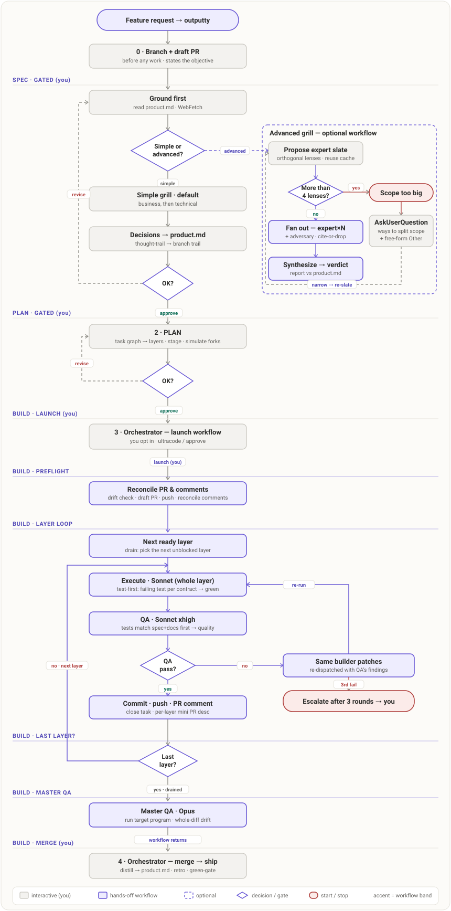

# outputty

outputty is a thin, deliberately unoriginal spec-driven Claude Code plugin. It invents almost nothing
— it wires together tools that already do the hard parts and adds just enough logic to sequence them:

- **grill-with-docs** — Matt Pocock's interview skill; the questioning engine behind the SPEC phase.
- **OpenWolf** — operational memory + token discipline.
- **ponytail** — the laziest-working-diff build discipline.

The only original parts are the **loop** that carries a feature through grill → plan → hands-off build
(per-layer iteration, a single escalation), and a handful of **documentation patterns** I kept
reaching for, packaged as `outputty-documentation`.

## Requirements

Needs **OpenWolf** (`openwolf init`) and **git**; the full flow also needs a **GitHub remote +
authenticated `gh`** (it opens a draft PR). Anything missing is surfaced at session start.

## Install

```bash
claude plugin marketplace add F:/outputty/claude-plugin   # or your private GitHub URL
claude plugin install outputty                            # pulls ponytail automatically
```

Then, once, remove the standalone grill copy so there's a single source of the grilling engine:

```bash
rm -rf ~/.claude/skills/grill-with-docs
```

You'll know it's live when a change request opens the **SPEC grill** (business questions first)
instead of jumping straight to code.

## The flow

Describe the work — the `outputty` skill triggers on any feature or change request (or run
`/outputty <what you want>`). One feature branch carries the whole cycle: **two human-gated phases up
front, a hands-off build behind them, and a single escalation as the only interruption.**



0. **Branch + draft PR** — cut `feature/<x>` and open a draft PR before any work, so scoping and code review together.
1. **SPEC** *(gated)* — grill business then technical goals as distinct passes; log a thought-trail.
2. **PLAN** *(gated)* — write the task graph (tasks + deps); `tasks.js schedule` derives the layers; you OK the schedule.
3. **BUILD** *(hands-off)* — a dynamic workflow: per task, cast the roles, execute, review; passed tasks commit serially. Retry once, escalate on a double failure.
4. **Merge** — distill the trail into `product.md`, green-gate, mark the PR ready, merge.

**Brownfield repo** with no `.claude/product.md`? Run `/outputty-init` once to reconstruct it from
your existing docs and history. Grill anything ad hoc with `/outputty-grill`.

## Design

outputty owns only the flow and one product doc; everything else is delegated. Architecture, the
memory boundary, and what was tried live in [`.claude/product.md`](.claude/product.md) — the single
source (it's dogfooded). The one rule to carry: **decisions live only in `product.md`**; OpenWolf's
`.wolf/` holds navigation, gotchas, and bugs, never decisions.

## Safety

BUILD runs shell and git autonomously, so PreToolUse hooks guard it — destructive-command denial,
secret-content and secret-file blocking, and the `require-environment` edit guard. For the guard
details and a copy-paste secret-file deny-list to add to your own `settings.json`, see
[`docs/security.md`](docs/security.md).
