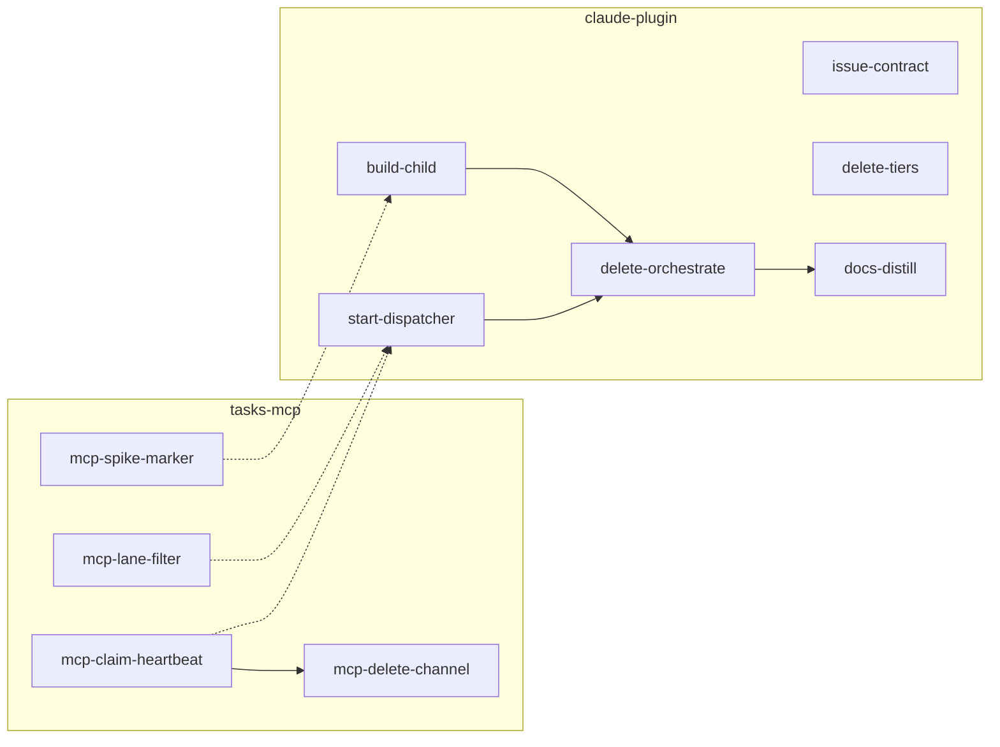
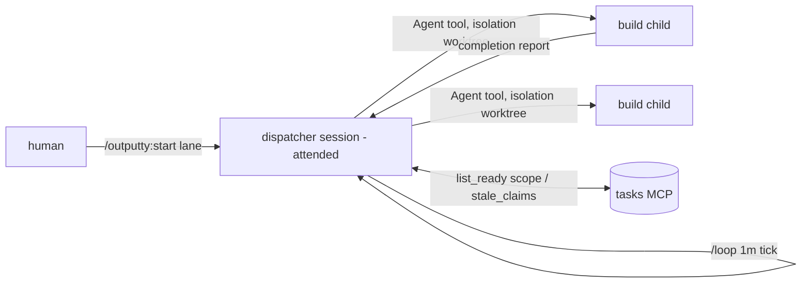
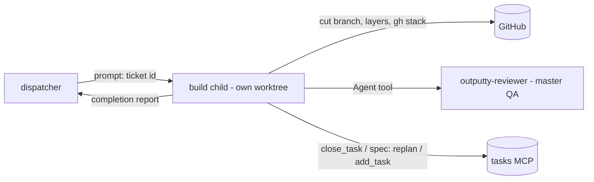

# Queue-driven dispatch - ticket set

> Historical record of a shipped target (0.78.0-0.80.0). Its **wave semantics** constraint was
> superseded at 0.97.0 by rolling dispatch - see `.claude/lessons.md` and `skills/start/SKILL.md`.

The master orchestrator pane is deleted. The queue coordinates: the tasks server carries claims with
heartbeats and lane filters, an attended `outputty:start` session wave-dispatches unattended background
build children on a one-minute loop, children close or refile their own tickets, and the channel is
deleted. Builds stay single-writer inside each child - within-layer parallelism stays deferred with the
agent-teams roadmap row.

Two projects. File the `mcp-*` tickets against
[tasks-mcp](https://github.com/outputty/tasks-mcp), the rest against this repo. Cross-repo ordering that
`deps` cannot express: **`mcp-claim-heartbeat` and `mcp-lane-filter` merge before `start-dispatcher`
dispatches anything, and `mcp-delete-channel` merges last of the server tickets.**



---

## Target - `queue-driven-dispatch`

`add_target { id: "queue-driven-dispatch", title: "Queue-driven dispatch (no master pane)" }`

**Brief:** Every dispatched item today pays for a standing orchestrator LLM whose duties are half pane
ceremony (worktree, grid layout, tier flags) and half deterministic bookkeeping (cap, sweep, relay), and
whose relay of a child's verdict is an information-losing hop by its own contract ("relay, never
re-verify"). The pane is also the single point that must stay alive for the queue to move: no pane, no
dispatch. Why now: the platform primitives the pane papered over now exist natively - background
subagents with worktree isolation, completion notifications that wake the parent, and an in-session
loop (`/loop`) for the fallback tick - and the one duty that genuinely needs a global view (claim
liveness) migrates into the tasks server, the same move that already worked for duplicate-dispatch at
0.70.0. What it stops costing: one always-on session per repo, the Herdr ceremony on every dispatch, and
a coordination layer the operator maintains for no felt gain.

---

## tasks-mcp tickets

The four server tickets live in the tasks-mcp repo, one authoritative copy:
[tasks-mcp/docs/queue-driven-dispatch.tickets.md](https://github.com/outputty/tasks-mcp/blob/main/docs/queue-driven-dispatch.tickets.md).

1. **`mcp-claim-heartbeat`** - claims carry `claimed_at`/`heartbeat_at`, refreshed as a side effect of
   existing writes; `list_ready` surfaces `stale_claims`. Flag, never auto-release.
2. **`mcp-lane-filter`** - `list_ready { scope }` filters by folder intersection; every row carries an
   advisory `overlap` list of live claims whose scope intersects.
3. **`mcp-spike-marker`** - `tags: ["spike"]` rides the `list_ready` row; settle first whether tags
   already flow through.
4. **`mcp-delete-channel`** - `notify`, the announce spool, and the launch flag deleted; deps on
   `mcp-claim-heartbeat`, ships last and clearly flagged.

---

## claude-plugin tickets

### `start-dispatcher` - `outputty:start`, the attended wave dispatcher

`{ id: "start-dispatcher", scope: ["skills/start"], deps: [] }`
Cross-repo: needs `mcp-claim-heartbeat` and `mcp-lane-filter` merged.

#### Brief

## Problem

Dispatch today needs a standing orchestrator pane under Herdr running four hand-typed ceremonies per
item (resolve base, cut worktree, move pane into a grid, start agent with tier flags) and an always-on
channel subscription to know when to move. The ceremony is deterministic work an LLM re-derives each
time, the pane must stay alive for the queue to move at all, and its one irreplaceable duty - claim
liveness - is moving into the server (`mcp-claim-heartbeat`). What is missing is the thin attended loop
that remains: pick a lane, dispatch a wave of unattended children, hold quietly while they work, sweep
and re-dispatch when they drain.

## Expected solution

A human starts a plain Claude session in the primary checkout and runs:

```text
/outputty:start skills
```

With no argument the skill asks - lane or everything - via `AskUserQuestion` (legal here: this session
is attended). Then the loop, for the session's whole life:

```text
wave:   sync -> list_ready { scope: lane } -> refuse any row with non-empty overlap
        -> spawn one background agent per ticket (isolation: worktree), up to the cap
        -> invoke /loop 1m with the tick prompt
tick:   any child still working        -> no-op tick, nothing else
        zero working                   -> relay verdicts · fast-forward checkout · release stale claims
                                          -> re-run list_ready -> dispatch next wave
        drained, nothing blocked       -> stop the loop -> drain report + roadmap curation pass
child completion mid-wave              -> relay that verdict, fast-forward if it merged - NEVER dispatch
```

Output shape - the drain report:

```text
LANE skills - drained
1. csv-export      merged   feature/csv-export #41-#43 (3 layers, master QA pass)   [child's verdict, quoted]
2. spike-csv-shape spike    drafted task csv-export-v2, no merge
ROADMAP: row "analyst-self-serve" now easy - csv-export shipped the export seam
```

- **Sibling:** `skills/orchestrate/SKILL.md` - the role being replaced; its "Watch, and finish" relay
  contract and fast-forward step carry over verbatim in spirit.
- **Architecture:**



- **Where:** `skills/start` (new folder).
- **Anchor:** `skills/orchestrate/SKILL.md:80` (fast-forward: "Nothing does this for you"), `:149` (the
  machine cap), `:156` (the crash sweep this loop absorbs via `stale_claims`).

#### Contract

## Definition of done

1. Dispatching the `examples.md` graph: with `order-store` ready and `csv-export` blocked on it, wave 1
   dispatches `order-store` alone; after its child merges, a tick (not the completion wake) dispatches
   `csv-export`. One task in, one merged stack out per child, as the base program's cycle defines.
2. Ticks while any child works are marked no-op; the terminal shows a collapsed streak, not a line per
   minute.
3. A child killed mid-run: within one tick after the wave otherwise drains, its claim shows in
   `stale_claims`, the dispatcher releases it with `edit_task { spec: "replan" }`, and the task is
   re-dispatched in the next wave.
4. An early-finishing child in a two-child wave gets its verdict relayed on its completion wake, and no
   dispatch happens until a tick finds zero working children.
5. The wave refuses a `list_ready` row with non-empty `overlap`, reporting it as a mis-drawn lane
   instead of dispatching it.
6. The cap holds: a lane with six ready tasks dispatches at most the cap per wave.
7. On drain: the loop stops (no orphan wakeups), and the report prints every item with its child's
   quoted verdict plus the roadmap pass ("nothing changed" allowed only by looking).

## Constraints to respect

- **Cap 3 children per wave, stated in the skill** - the measured machine death was at seven sessions
  (`skills/orchestrate/SKILL.md:149`), and each child runs its own test watcher; 3 also matches the
  attended-review ceiling practitioners converge on.
- **Wave semantics are deliberate** - the slowest child gates the wave; a 5-minute child waits for a
  40-minute sibling. Accepted for its simpler machine: dispatch always runs against an empty in-flight
  set, so overlap checking needs only the wave being assembled plus other lanes' claims.
- **`/loop` with a 1-minute interval; 60 seconds is the scheduler's floor** - the tick is the only
  dispatch point; completion wakes relay and fast-forward only, or case 4 breaks.
- **The dispatcher never writes code and never re-verifies a child's QA** - the relay contract survives
  the pane. Its writes are: task releases, the fast-forward, and the drain report.
- **The loop dies with the session; children do not** - a closed terminal orphans running children,
  which is exactly why staleness lives server-side. The skill states this boundary so an operator
  closing the window knows what keeps running.
- **Fast-forward after every merged child, before anything else** - this session sits in the primary
  checkout, and nothing else updates it (`skills/orchestrate/SKILL.md:80`).

## Open questions

- **Settle first:** the exact harness surface for "count of working background agents" at tick time.
  The builder verifies what the platform exposes and picks it; the contract only requires the count to
  be reliable enough for cases 2 and 4.

---

### `build-child` - the build skill runs as an unattended background child

`{ id: "build-child", scope: ["skills/build"], deps: [] }`
Cross-repo: needs `mcp-spike-marker` for case 3.

#### Brief

## Problem

`skills/build/SKILL.md` assumes a Herdr pane: it is prompted with a pre-cut branch, prints recaps "in
the pane", rings the doorbell on escalation (`:221`), and relies on a master pane to sweep its claim if
it crashes. Under queue dispatch the child is a background agent in an isolated worktree cut from the
default branch, whose only channel back is its completion report, and whose ticket must carry
everything - there is no planning session behind it and no human in front of it.

## Expected solution

The entry and exits change; the layer loop, the two-exits contract, and merge discipline stay verbatim.

```text
in:   one ticket id + a worktree cut from the default branch (isolation: worktree)
      -> cut feature/<kebab> itself · start_task · ORIENTATION · layers · master QA · merge
out:  a completion report - one of:
        merged:    stack refs + master QA verdict + per-layer recap
        replan:    the Attempt note verbatim + spec: replan set        (existing exit, unchanged)
        escalate:  the four-part escalation shape                      (report replaces the doorbell)
spike ticket (tags: ["spike"]): deliverable is add_task { discovered_from } + a trail note - no merge
```

Non-spike tickets fold planning in: the child plans from the ticket's contract alone, with no SPEC/PLAN
gate - the gate relocated to ticket authoring (`issue-contract`).

- **Sibling:** `skills/build/SKILL.md` - this is a revision of it, not a new skill.
- **Architecture:**



- **Where:** `skills/build`.
- **Anchor:** `skills/build/SKILL.md:10` (two exits, no questions - now load-bearing:
  `AskUserQuestion` is stripped from every subagent), `:18` (claim first), `:36` (replan sets
  `spec: replan`), `:221` (the doorbell line this removes).

#### Contract

## Definition of done

1. The `examples.md` layer case end to end from a dispatched child: contract to failing test, layer
   ships as `feature/csv-export-l2 #42`, task closes inside that commit.
2. A requirements gap: the child scratches, writes the `Attempt -` note in its fixed shape, sets
   `spec: replan`, and its completion report carries the note verbatim. No doorbell call anywhere in
   the skill.
3. A `tags: ["spike"]` ticket: the child's deliverable is a drafted task (`add_task` with
   `discovered_from`) plus a trail note; nothing merges; the report names the drafted id.
4. Master QA still runs as its own subagent from inside the child (depth main -> child -> QA is 2,
   inside the platform's limit of 3), and the child routes the verdict without re-judging it.
5. The skill contains no Herdr, pane, or channel reference.

## Constraints to respect

- **Keep the two-exits contract verbatim** - a subagent structurally cannot ask
  (`AskUserQuestion` stripped even when listed), so "neither exit asks a question" moved from policy
  to physics; weakening it now produces silent guessing.
- **The worktree base is the remote default branch** (`worktree.baseRef` default `"fresh"`,
  code.claude.com/docs/en/worktrees) - correct for per-item work, and the reason the child cuts its own
  feature branch as its first git act. Do not set `baseRef: "head"`: it would drag the dispatcher's
  local state into every child.
- **Permission prompts surface into the attended dispatcher session** - so the allowlist step
  (`CHECKS`, `git`, `git push`, `gh` in `.claude/settings.local.json`) stays, and its consequence
  flips: a prompt is now a visible dispatcher event, not a silent overnight stall.
- **The escalation report replaces the doorbell, so it must be complete** - the four-part shape
  (`skills/build/SKILL.md:203-217`) is the whole message; a child cannot be asked a follow-up after it
  exits.

## Open questions

- (none - `spec: replan` and `close_task` already exist; this ticket re-plumbs entry and exits only)

---

### `issue-contract` - the ticket becomes the gate

`{ id: "issue-contract", scope: ["skills/issue-authoring"], deps: [] }`

#### Brief

## Problem

`build-child` deletes the SPEC/PLAN gates for normal tickets: a child builds from the ticket alone,
unattended. The gate does not disappear - it relocates to ticket authoring. A ticket that is not
build-ready no longer pauses an interview; it produces autonomous guessing in a session nobody
watches. `skills/issue-authoring/SKILL.md` today defines a good issue but does not enforce a
dispatchable one, and `skills/planning/SKILL.md` still frames gated SPEC/PLAN as the only path to
`spec: settled`.

## Expected solution

```text
issue-authoring: gains a "dispatchable" bar - a ticket a cold, unattended child can build:
                 contract present (numbered, checkable), scope folder present, done-when stated,
                 every open question either settled or tagged spike
planning:        reframed as the optional human-run path that PRODUCES such tickets for big items;
                 small items may be authored directly against the bar
```

Output shape - the bar, as a checklist a planning session or a human runs before `spec: settled`:

```text
[ ] contract: numbered cases, each runnable by a stranger
[ ] scope: one folder
[ ] done-when: one checkable condition
[ ] no unsettled open question (or tags: ["spike"])
```

- **Sibling:** `skills/issue-authoring/SKILL.md`'s existing checklist - this adds the dispatch column.
- **Architecture:** none - a rule change in two prose skills, no new seams.
- **Where:** `skills/issue-authoring` (and one reframing pass in `skills/planning`).
- **Anchor:** `skills/build/SKILL.md:23-31` (the replan exit is what catches a ticket that fails this
  bar - at the cost of a full dispatched child).

#### Contract

## Definition of done

1. The `examples.md` `add_task` example passes the bar as written (it carries brief, contract, scope) -
   the bar is calibrated so the canonical example is dispatchable.
2. A ticket missing its contract fails the checklist by inspection, and `planning`'s settle step
   (`skills/planning/SKILL.md:27`) names the bar before `spec: settled`.
3. `planning/SKILL.md` states its new position: optional, human-run, produces dispatchable tickets;
   invoked for items too big or contested to author directly.

## Constraints to respect

- **The bar is prose applied at authoring time, and says so** - nothing loads it at dispatch. The
  runtime backstop remains the child's replan exit; the bar exists to make that exit rare, and the
  skill states this honestly rather than claiming enforcement it does not have.

## Open questions

- (none)

---

### `delete-tiers` - the tier mechanism is deleted

`{ id: "delete-tiers", scope: ["skills"], deps: [] }`

#### Brief

## Problem

A task's `tier` maps to `--model`/`--effort` flags pasted at process launch by exactly one reader:
`skills/orchestrate/SKILL.md:51-58`. Queue dispatch spawns children with the `Agent` tool, which has a
`model` parameter and no `effort` parameter - so tier cannot survive dispatch as designed, and the
roster's own caveat concedes "no tier has a recorded completed build" (`skills/orchestrate/SKILL.md:61-63`).
Porting it means four bespoke writing charters, re-minting the artifact this repo deleted at 0.47.0.
Deleting it means children inherit the dispatcher's session model, one knob the human already holds.

## Expected solution

```text
planning settle step:  edit_task { spec: "settled" }            (tier no longer set)
dispatch:              Agent tool, no model override            (child inherits the session model)
a heavier item:        the human starts the dispatcher session on a bigger model - the whole lane rides it
```

- **Sibling:** none - a deletion.
- **Architecture:** none - a field falls out of use; the server keeps accepting it for old data.
- **Where:** `skills` (every file the grep below names).
- **Anchor:** `skills/orchestrate/SKILL.md:51-58` (sole reader); `skills/planning/SKILL.md:27` (sole
  writer); `rg -l tier skills/` currently names eight files.

#### Contract

## Definition of done

1. `rg -n "tier" skills/ agents/` returns no instruction to set, read, or map a tier (mentions in
   lessons/history quotes exempt).
2. The `examples.md` `add_task` example no longer carries `"tier": 3`.
3. `planning`'s settle step reads `spec: settled` with no tier clause; `qa` and `grill` lose their
   tier references.

## Constraints to respect

- **The server field stays** - tasks-mcp keeps accepting `tier` so old issues round-trip; the plugin
  simply stops writing it. Removing the server field is its own ticket if ever wanted, not this one.
- **Per-item model choice degrades to per-lane** - stated plainly in the skill: a lane's children ride
  the dispatcher's model. If per-item choice is missed in practice, the record shows where it went.

## Open questions

- (none)

---

### `delete-orchestrate` - delete the master pane and the Herdr layer

`{ id: "delete-orchestrate", scope: ["skills"], deps: ["start-dispatcher", "build-child"] }`

#### Brief

## Problem

With `start-dispatcher` dispatching and `build-child` reporting, the orchestrate skill's remaining
content is ceremony for a pane that no longer exists: the Herdr worktree/grid protocol, the tier
launch table, the channel subscription, and a role-detection block (`skills/init/block.md:13-23`) that
routes sessions by `HERDR_ENV`. Leaving it invites the exact drift this repo's memory warns about: a
skill that still names a deleted mechanism.

## Expected solution

```text
deleted:   skills/orchestrate/ (whole)
rewritten: skills/init/block.md - roles become: attended session (planning or /outputty:start)
           vs dispatched child (first prompt names the stage); orchestrator write boundary removed;
           the two-stages diagram loses the <channel> arrow; notify (tool 10) leaves the tool list;
           "Under Herdr" rules removed
edited:    skills/planning/SKILL.md:33-37 and skills/build/SKILL.md:221 - doorbell rings removed
           README.md - the Herdr orchestration section replaced by the dispatcher flow
```

- **Sibling:** none - a deletion plus the block rewrite `init` already owns.
- **Architecture:** none - seams removed.
- **Where:** `skills` (plus `README.md`).
- **Anchor:** `skills/init/block.md:13-23` (role detection); `README.md:223` (`HERDR_ENV` claim);
  `rg -n HERDR_ENV skills/ README.md` for the sweep.

#### Contract

## Definition of done

1. `rg -n "HERDR_ENV|herdr|orchestrat|notify|doorbell|channel" skills/ README.md` returns no
   instruction referencing the deleted layer (product-memory history exempt).
2. `init` re-run against a repo produces a block with the two-role table and no `notify` in its tool
   list; the block's stage diagram carries no channel arrow.
3. The plugin version bumps minor in `.claude-plugin/marketplace.json` (merge duty: `skills/` changed).

## Constraints to respect

- **Herdr survives as the user's multiplexer, unmanaged** - the plugin stops referencing it; nothing
  stops a human running dispatcher sessions inside Herdr panes. The README says this in one line so
  the deletion reads as a boundary, not a breakage.
- **Merges after `start-dispatcher` and `build-child` are proven on one real item** - deleting the old
  path before the new one has a recorded run repeats the mistake this branch's research flagged:
  the orchestrate skill itself died with zero recorded runs.

## Open questions

- (none)

---

### `docs-distill` - product memory records the new shape

`{ id: "docs-distill", scope: [".claude"], deps: ["delete-orchestrate"] }`

#### Brief

## Problem

After the flow changes, `architecture.md` still describes a channel-woken build and a Herdr
orchestrator, `roadmap.md` still carries the design rationale nowhere, and the decision this ticket
set implements - queue as coordinator, no master agent, writes single-threaded per child - exists only
in a branch conversation. The next session to touch orchestration would re-litigate it, which is the
exact failure `lessons.md` exists to prevent (the 0.12.0 fan-out entry is what stopped this branch
from rebuilding per-task fan-out).

## Expected solution

```text
architecture.md: Flow + "What it stacks on" rewritten - two roles (attended dispatcher, unattended
                 child), the queue as the join, Herdr removed from the platform list
lessons.md:      one entry recording this decision beside the 0.12.0 one: what was deleted, what the
                 evidence was, and the rule - fan out reads, never writes; queue coordinates, no
                 master agent
roadmap.md:      the queue-driven-dispatch target row resolves to its issue link; the agent-teams row's
                 why updated (within-layer parallelism still deferred - this change did not touch it)
README.md:       covered by delete-orchestrate; this ticket verifies consistency only
```

- **Sibling:** `.claude/architecture.md`'s existing Flow section - same document, new content.
- **Architecture:** the diagram in `start-dispatcher`'s brief is the one `architecture.md` adopts.
- **Where:** `.claude`.
- **Anchor:** `.claude/architecture.md:44-52` (the platform list naming Herdr); `.claude/roadmap.md`
  Live section; `.claude/lessons.md:922` (the 0.27.0 entry the new entry sits beside).

#### Contract

## Definition of done

1. `architecture.md`'s cycle diagram shows dispatcher -> children -> queue with no channel node, and
   its platform list carries no Herdr row.
2. The lessons entry names the deleted mechanism, the 0.12.0 precedent, and the standing rule, each
   with its anchor - written for a session that was not here.
3. `roadmap.md`: this target's row links its issue; the agent-teams row still reads as deferred and
   its why no longer cites the master pane.

## Constraints to respect

- **Lessons record pivots, not features** (`skills/build/SKILL.md` merge step 2) - the entry is about
  what was abandoned and why, not a changelog of the new skill.

## Open questions

- (none)
