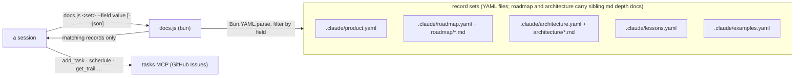

# The product docs (canonical) — five record sets, loaded by role

Product memory is **five YAML record sets**. Two (`roadmap`, `architecture`) carry a sibling folder of
markdown depth docs. This file is their canonical shape. SPEC (PLANNING), `bootstrap` (brownfield), and
the merge distill all write them **from this file**. The task graph is not here — it lives in the `tasks`
MCP server (synced to GitHub Issues).

Roles: **product = why · roadmap = what we're building · architecture = what exists · lessons = the
past · task graph = how** (in the `tasks` MCP).

**The split is MECE. Each session loads only its slice.**

| File | Holds | Who loads it |
| --- | --- | --- |
| `.claude/product.yaml` | North Star + Language | **Every session** (the protocol's load-first rule) |
| `.claude/roadmap.yaml` | one mini-spec record per target | SPEC, PLAN, BUILD's per-layer staleness check, master QA |
| `.claude/roadmap/*.md` | the full writeup of one shipped target | whoever a row's `doc` field points there |
| `.claude/architecture.yaml` | the coverage index + `target_program`/`protocols` | SPEC (technical pass), PLAN, BUILD, master QA |
| `.claude/architecture/*.md` | the depth: one self-contained topic file per area | whoever an index entry's `doc` points there |
| the `tasks` MCP server | the task graph + each task's trail, synced to GitHub Issues | audit, branch start, PLAN, BUILD, merge |
| `.claude/lessons.yaml` | discoveries, bug fixes, user directions, experiments | grill's ledger, repeat work, master QA when stuck |
| `.claude/examples.yaml` | the canonical worked examples, named | anyone showing or authoring an example |

**The file tree is fixed.** Every project carries exactly this. No extra memory files, no renames.
Author each file from its skeleton below.

```
.claude/
├── product.yaml              # North Star + Language — every session reads this
├── roadmap.yaml              # what we're building: one mini-spec record per target
├── roadmap/
│   └── <name>.md             # the full writeup of one shipped target
├── architecture.yaml         # what exists: the coverage index (+ target_program, protocols)
├── architecture/
│   └── <topic>.md            # depth: one self-contained topic file per area, Mermaid inline
├── lessons.yaml              # the past: discoveries, bug fixes, user directions, experiments
└── examples.yaml             # the canonical worked examples, named
```

The task graph is **not a file** — see "The task graph — how" below.

**Migration:** a repo with a monolithic `product.yaml` splits it at the next merge step. Move the
sections. Leave a one-line pointer per moved section at the top of `product.yaml` until the next cycle
confirms nothing still expects them there.

## Living docs, one archive

`product.yaml`, `roadmap.yaml`, and `architecture.yaml` are **living: pruned, never append-only.**
Delete prose a decision makes stale. A real pivot worth remembering goes to `lessons.yaml`, the **only
append-only doc**, written at the merge step.

## The hard verification rule (non-negotiable)

**Every claim about already-shipped behaviour, in any set, is backed by a run in the codebase — no
guessing, no recall.**

- **Shipped (✅) ⇒ run it.** Use the actual result. Prose describing shipped behaviour that wasn't run
  is a defect.
- **Target (🔨 / 📋) ⇒ mark it expected.** Never assert it as shipped. ✅ means "I ran this, here's real
  output."

This rule governs every set below. Each later restatement is a reminder of it, not a new rule.

## `.claude/product.yaml` — North Star + Language

Keep it small — **every** session reads it.

- **North Star: pitch + wedge.** The elevator-pitch paragraph in plain language, no technical examples.
  Then high-level examples, one per strong side. Then the precise **wedge**: the specific thing this does
  that alternatives don't.
- **Language: the glossary.** Every canonical term, one line: definition + the rejected synonyms it
  `replaces`. Current vocabulary only; delete a dead term. Pin a term here **before** using it elsewhere.

## `.claude/roadmap.yaml` + `roadmap/<name>.md` — the targets

One record per **high-level target you can name in one sentence** (a new engine, a rework, CI/CD +
deployment). Order the rows so dependencies precede dependents. Keep it light enough to process whole
without grepping.

- **Every row carries `summary`: a mini-spec.** A problem statement with a clear solution, plus an **e2e
  code snippet with example inputs and outputs** for the desired shape. Shipped row: output is **real
  observed data**. Open row: the desired shape, marked. Killed row: the problem it chased + the proposed
  shape. Behaviour added, removed, or changed ⇒ in/out examples required.
- **A shipped target closes clean:** status `✅`, a one-line `status_detail`, `doc: roadmap/<name>.md`
  carrying the full writeup. **No notes accumulate on the row.** `absorbs:` lists former row numbers the
  writeup covers.
- **The writeup doc** follows the project's own communication patterns: the capability in one paragraph,
  **Before / After** on the canonical example, **The arc** (how it got here), **Where the record lives**
  (the code, tests, docs that now own it).
- **High altitude only.** A non-critical bug, a spike, a debt item, or any task-shaped work goes to the
  `tasks` MCP server (`add_task`), never here.
- **The pitch stays in `product.yaml`.** `north_star` = WHY. The roadmap = WHAT is being built.
  `architecture.yaml` = what already exists.
- **Live rows carry a plan reference, not progress prose.** Link the task in the `tasks` MCP; its graph,
  state, and trail live there.
- **Killed rows stay.** Their reasoning lives in `lessons.yaml` and git.
- **Target-level product memory, not task tracking.** The task graph never moves here.

## `.claude/architecture.yaml` — the coverage index, with depth in topic files

Two layers: a YAML **coverage index** and markdown **topic files**. **One index record per feature,
knob, limitation, and code pattern** (`kind: pattern`) — one per thing a user uses or must work around.
Every strategy family accounted for. Every major component (each engine, each top-level class) described
individually, never lumped.

1. **The target program first** (`target_program` prose section): the canonical top-level call, end to
   end, one fenced code block, with **Input / Output as distinct valid-JSON blocks** (real values, no
   ellipsis; ✅ real, 🔨/📋 marked expected). PLAN pins the last layer to it, master QA runs it, every PR
   write snapshots it (`pr-description.md`).
2. **The index** (`features` records): one record per feature/knob/limitation/pattern — `name`, `kind`,
   `what` (plain-language, high-level), `how` (the technical solution, summarized), `doc` (its topic
   file), `example` (the canonical example's name in `examples.yaml`, or `""`), and `related`: **every
   other entry this one touches, by exact name.** An unnamed reference is incomplete. A `status` field
   marks an unshipped entry; its absence means shipped and verified.
3. **The depth** (`architecture/<topic>.md`): each topic file is **self-contained — a reader opens ONE
   file and understands a feature, knob, or limitation in full without digging.** It carries the in-depth
   description, the flow diagram as **inline Mermaid** (never a `.mmd` file), the real e2e examples from
   `examples.yaml`, the gotchas, and links to the topics it touches. One `##` section per index entry
   whose `doc` points here; the heading text is the entry's `name`. With an executable-docs harness,
   every code fence runs in it.
4. **The seams** (`protocols` records): parent-supplies → child-returns, one record per seam. PLAN
   derives task `contract`s from these.
5. **Mermaid, never SVG.** (SVG via `diagram` is for the README + PRs.)

Design rationale for a mechanism that **no longer exists** goes to `lessons.yaml`, not here.

## External facts — routed to their reader, never ledgered

A fact about something **outside the repo** — an external system's behaviour, a library's semantics, a
platform constraint, an API limit — is validated **by running or fetching against the external thing and
capturing the actual result**. Then write it **where its reader works. There is no separate evidence
ledger:**

| The fact is | It lives in |
| --- | --- |
| A standing rule every session must obey | the project's **CLAUDE.md**, as a clear, prescriptive instruction |
| A design constraint the architecture rests on | a **`kind: limitation` index entry** in `architecture.yaml` + its topic file, carrying its re-verification hook (probe command or source anchor) inline |
| A constraint one function depends on | that **function's comment** |
| A proven multi-step procedure | a **skill** (`.claude/skills/<name>/`) or rules file the moment it applies |
| Your own code's behaviour | **`architecture.yaml`**, governed by the hard verification rule |
| What this project tried and measured about itself | **`lessons.yaml`** |

Two rules stand in for a ledger:

- **Every routed fact keeps its re-verification hook inline:** the cheapest run that re-settles it —
  ideally "run the `spike-<slug>` test", which stays in the suite as the standing probe. When work needs
  something a written fact rules out, **re-verify by RUNNING the named probe, never by trusting the
  line.**
- **A fact nobody reads is deleted, not filed.**

## The task graph — how: in the `tasks` MCP server

The tracker the roadmap must not become. **Not a repo file** — the graph and each task's mutable state
live in the `tasks` MCP server, one task per GitHub Issue. A task carries `deps`, a `scope` folder,
`tier`, `qa`, `spec`, and its **trail**: a comment thread of `decision`/`action`/`note` entries.

**Author and read it through the MCP tools:** `add_task`, `close_task`, `amend_task` (widen scope or
amend wording); `list_ready` / `list_planning`; `schedule` (derive layers); `get_trail` / `append_trail`.
The graph is never hand-edited as YAML, and `docs.js` does not serve it.

How it connects: **audit's task-shaped picks are filed with `add_task`** (target-level picks go to the
roadmap); a branch starts by picking a task; **PLAN authors the graph**; the merge step closes each task.
`schedule` derives the layers from `deps`; a dependency cycle fails loud.

## `.claude/examples.yaml` — the canonical examples, reused everywhere

Every worked example lives here, **named**, one canonical example per concept (MECE). Each record:
`name`, the code/call, and `input`/`output` per the JSON rules. **Reuse beats invention:** a doc, brief,
grill turn, spike case, or PR write-up uses the canonical one **verbatim** — copied, never paraphrased.
Pin a new example here **first**, then use it. If it overlaps an existing one, evolve that one instead.

## `.claude/lessons.yaml` — the archive

**Discoveries, bug fixes, user directions, experiments — never features.** Chronology oldest → latest,
one entry per pivot: beginning state · problem · end state · trail link. Also carries abandoned
approaches and what killed each. A feature's story belongs in its PR and its roadmap row. Append-only;
written at the merge step; read on demand. **Its absence means a first cycle, not an error.**

## The YAML record shapes — queried, not read whole

Every surface below is authored as **YAML text**, answered through
`skills/outputty/docs.js <set> [--section <name>] [--<field> <value>] [--fields a,b] [--json]` — a query
against the record set, not a read of the whole file. `docs.js` runs on **bun** and is **read-only**: it
never writes a doc.

**Author prose as a YAML `|` block, never generate it with `Bun.YAML.stringify`.**

**The prose-in-YAML convention** (`architecture` and `lessons` both lean on it): a section that was a
whole markdown paragraph or bulleted run — not a short field — stays exactly that, verbatim, as one `|`
block value under a section key. Converting a doc to YAML never forces its prose into fields it doesn't
have. Only genuine record-shaped lists become records: a table row, or a bullet that is really
`{ field: value, … }` repeated. **A Mermaid diagram stays inline** — a ```mermaid fence in the `|` block
or the topic file that owns it — **never a separate `.mmd` file**.



Each set's records. **A field in `[brackets]` is optional:** real records often omit it, so a `--fields`
query naming it returns nothing — `docs.js` warns on stderr when a requested field matches zero records,
so read that warning rather than concluding the set is empty. A **list** set is queried directly (no
`--section`). A **sectioned** set is a YAML mapping — a prose `|` block alongside record-list sections —
and `docs.js <set> --section <name>` picks one. Omitting `--section`, or naming a missing one, fails loud
and names the sections that exist.

| Set | Shape | One record is | Array fields (match by containment) |
| --- | --- | --- | --- |
| `product` | sectioned: `north_star` (prose), `language` (records) | a glossary term: `{ term, definition, replaces: [] }` | `replaces` |
| `roadmap` | list | one target row: `{ row, feature, summary, status, depends_on: [], links: [], [status_detail], [doc], [absorbs] }`; `status_detail`/`doc`/`absorbs` are shipped-row fields | `depends_on`, `absorbs`, `links` |
| `architecture` | sectioned: `target_program` (prose) + `features`/`protocols` (records) | one index entry: `{ name, kind, what, how, doc, example, related: [] }`; one seam: `{ protocol: "stage -> gh", from, to, in, out }` | `related` |
| `lessons` | list | one chronology entry: `{ title, kind, files: [], body, [version] }` (`body` is a `\|` block; `version` only where the project versions releases) | `files` |
| `examples` | list | one named worked example: `{ name, input, output }` | - |

The task graph is **not a `docs.js` set** — it lives in the `tasks` MCP server. A task carries
`{ id, title, deps: [], scope: [], tier, qa, brief, [contract], spec }` plus its trail. Author it with
`add_task`/`amend_task`, read it with `list_ready` / `schedule` / `get_task` / `get_trail`.

`docs.js product --section language --term Layer --json` against
`{ language: [{ term: "Layer", definition: "…", replaces: ["wave"] }] }` →
`[{ "term": "Layer", "definition": "…", "replaces": ["wave"] }]`.

Any surface not yet converted to YAML stays markdown until its own task lands. `docs.js` fails loud on a
set that does not exist: `unknown record set`, or a missing-file error.

## Skeletons (copy, fill, delete the guidance)

```yaml
# product.yaml — North Star + Language only. Every session loads this — keep it small.
# Every ✅ claim is verified by a run.
north_star: |
  <pitch paragraph; strong-side examples; Wedge: the precise thing alternatives don't do>
language:
  - term: <term>
    definition: <one-line definition>
    replaces: [<rejected synonyms>]
```

```yaml
# roadmap.yaml — one row per TARGET you can name in one sentence. (Rules above.)
- row: <n>
  feature: <the target, nameable in one sentence>
  summary: |
    Problem: <what is wrong or missing>. Solution: <the shape that fixes it>.

      <e2e code snippet — the desired call>

    Output (<REAL OBSERVED on ✅; desired shape, marked, on 🔨/📋>): <example inputs and outputs>
  status: "✅ shipped" # or 🔨 in progress / 📋 planned / ❌ killed
  status_detail: <one line>
  depends_on: []
  doc: roadmap/<name>.md # shipped rows only: the full writeup
  absorbs: [] # former row numbers the writeup covers — a cited "#n" greps to its story
  links: []
```

````markdown
# roadmap/<name>.md — the full writeup of one shipped target. The row keeps only the mini-spec.

# <Target> (roadmap #<n>)

<the capability in one paragraph — what a user can now do>

## Before / After

<the contrast, on the canonical example from examples.yaml — real observed output>

## The arc

<how it got here: the branches, the pivots, what was tried and dropped>

## Where the record lives

<the code, tests, docs, and PRs that now own this>
````

The task graph is authored in the `tasks` MCP server, not as a YAML file. PLAN files each task with
`add_task`:

```json
{
  "project": "<repo>",
  "id": "<kebab-slug>",
  "title": "<one line>",
  "deps": [],
  "scope": ["<folder the task may work in>"],
  "tier": 3,
  "qa": "subagent",
  "spec": "settled",
  "brief": "<end state, the verified file:line sites, what is out of scope>",
  "contract": "<what this task supplies to its dependents>"
}
```

- `tier`: 1-4, how much model the task needs (1 haiku … 4 fable). Default 3.
- `qa`: `skip` | `inline` | `subagent` — how much review the work earns. Default `subagent`.
- `spec`: `drafting` while the graph forms, `settled` once the `contract` holds, `replan` on a gap.
- The **trail** is the task's comment thread — append `decision`/`action`/`note` entries with
  `append_trail`, read them with `get_trail`.

`tier` and `qa` are **authored on the task at PLAN**, never chosen by the build session. Both default
safely, so absence never skips a step — but write them, so the task's model and review are explicit.

```yaml
# examples.yaml — the canonical worked examples, named, one per concept. Reused verbatim everywhere;
# a new example is pinned here first.
- name: <example name>
  input: |
    <the call / data — real values>
  output: |
    <the observed result — real if ✅, marked-expected otherwise>
```

```yaml
# lessons.yaml — the append-only archive: discoveries, bug fixes, user directions, experiments.
# Never features. Written at the merge step, oldest first.
- title: <the pivot, in one line>
  kind: discovery # or bugfix / direction / experiment
  files: [<the paths it touched>]
  version: <release it landed in> # only where the project versions its releases
  body: |
    Beginning state · problem · end state · trail link.
```

```yaml
# architecture.yaml — the coverage index: one record per feature/knob/limitation/pattern.
# Depth lives in .claude/architecture/<topic>.md — self-contained, Mermaid INLINE (no .mmd files).
target_program: |
  <the finished surface — a fenced code block + Input:/Output: examples>
features:
  - name: <entry name>
    kind: feature # or knob / limitation / pattern
    what: |
      <plain-language: what happens, high level>
    how: |
      <the technical solution, summarized>
    doc: architecture/<topic>.md
    example: "<canonical example name from examples.yaml, or ''>"
    related: [<every other entry this touches, by exact name>]
protocols:
  - protocol: "<parent> -> <child>"
    from: <parent>
    to: <child>
    in: <what the parent supplies>
    out: <what the child returns>
```

````markdown
# architecture/<topic>.md — one self-contained topic file per area. One `##` section per index entry
# whose `doc` points here; the heading text IS the entry's `name`. (Rules above.)

# <Topic>

<One short paragraph: what this file covers — and what belongs elsewhere, linked away:
"X itself belongs to [<entry name>](<other-topic>.md); this file only covers Y.">

```mermaid
flowchart LR
    <the topic's orientation diagram — inline, never a separate .mmd file>
```

## <entry name>

<What it is, before any mechanism — the index record's `what`, expanded.>

<How it works — the depth the index record's `how` summarizes.>

### Example

<the canonical example from examples.yaml, verbatim — the code fence, then Input:/Output: as distinct
valid-JSON blocks with real observed values (🔨/📋 marked expected). Run it through the project's
executable-docs harness when one exists.>

### Gotchas

- <the non-obvious edge — each related entry linked to its own section>
````
