# The product docs (canonical) — six record sets, loaded by role

Product memory is a **set of six record sets** — six YAML files, two of which carry a sibling folder of
markdown depth docs — not one file. This file is their
canonical shape — `spec.md` (SPEC), `bootstrap` (brownfield), and the merge distill all write them
**from this file**.

The four roles, one line each: **roadmap = why** (vision, ordered objectives). **architecture = what**
(every feature, knob, limitation and pattern, indexed and explained). **tasks = how** (the durable
tracker: bugs, debt, task-shaped work). **lessons = the past** (discoveries, bug fixes, user
directions, experiments).

**The split is MECE: every piece of product memory has exactly one home, and the set of homes covers
all of it.** A decision written in two docs drifts in two directions; a kind of memory with no home
lands in chat and dies with the session.

**Splitting alone saves nothing: six sets read together cost the same as one.** The point is that
different work needs different slices, so each session loads only its slice:

| File | Holds | Who loads it |
| --- | --- | --- |
| `.claude/product.yaml` | North Star + Language | **Every session** (the protocol's load-first rule) |
| `.claude/roadmap.yaml` | why/vision: ordered objectives with status | SPEC, PLAN, the before-dispatch staleness check, master QA |
| `.claude/architecture.yaml` | the coverage index + `target_program`/`protocols` | SPEC (technical pass), PLAN, BUILD agents, master QA |
| `.claude/architecture/*.md` | the depth: one self-contained topic file per area | whoever an index entry's `doc` field points there |
| `.claude/tasks.yaml` + `.claude/tasks/*.md` | the durable task index + per-task breakdown docs | audit (writes picks), branch start, PLAN, merge (flips status) |
| `.claude/lessons.yaml` | discoveries, bug fixes, user directions, experiments | grill's ledger, repeat work, master QA when stuck |
| `.claude/examples.yaml` | the canonical worked examples, named | anyone about to show or author an example — grill, SPEC, PLAN briefs, PR write-ups |

A triage session loads one small file; a build on a known feature loads two. PLAN still reads
everything — that is what PLAN is.

**The file structure is fixed.** Every project carries exactly this tree — no extra memory files, no
renames, and each file authored from its skeleton/template below:

```
.claude/
├── product.yaml              # North Star + Language — every session reads this
├── roadmap.yaml              # why: ordered objectives with status
├── architecture.yaml         # what: the coverage index (+ target_program, protocols)
├── architecture/
│   └── <topic>.md            # depth: one self-contained topic file per area, Mermaid inline
├── tasks.yaml                # how: the durable task index — bugs, debt, task-shaped work
├── tasks/
│   └── <slug>.md             # one breakdown doc per task that outgrows its one-liner
├── lessons.yaml              # the past: discoveries, bug fixes, user directions, experiments
├── examples.yaml             # the canonical worked examples, named
└── trails/
    ├── <branch>.trail.yaml   # per-branch spec thought-trail
    └── <branch>.tasks.yaml   # per-branch task graph (PLAN writes it, BUILD drains it)
```

**Migration:** a repo with a monolithic `product.yaml` splits it at the next merge step — move the
sections, leave a one-line pointer per moved section at the top of `product.yaml` until the next cycle
confirms nothing still expects them there.

## Living docs, one archive

`product.yaml`, `roadmap.yaml` and `architecture.yaml` are **living: pruned, never append-only.** When a
decision makes prose stale, delete it — a real pivot worth remembering goes to `lessons.yaml`, the **only
append-only doc**. It exists precisely so the living docs can stay lean: superseded detail has a home to
move to instead of lingering. (`lessons.yaml` is written at the merge step — the docs agent owns it.)

## The hard verification rule (non-negotiable)

**Every claim about already-shipped behaviour, in any of the six sets, is backed by a run in the
codebase — no guessing, no recall.**

- **Shipped (✅) ⇒ run it.** Before writing what an existing API/command/flag does, run it and use the
  *actual* result. Prose describing shipped behaviour that wasn't run is a defect.
- **Target (🔨 / 📋) ⇒ mark it expected.** Never assert it as shipped. The badge carries the obligation —
  ✅ means "I ran this, here's real output".

---

## `.claude/product.yaml` — North Star + Language

Small on purpose: this is the one file **every** session reads, so every word costs on every session.

1. **North Star — the pitch + the wedge.** The elevator-pitch first paragraph in plain language (no
   technical examples), then high-level examples one per strong side, then the precise **wedge** — the
   specific thing this does that the alternatives don't. The anchor the whole flow drift-checks against.
2. **Language — the glossary.** Every canonical term, one line each: definition + the rejected synonyms
   it replaces. Current vocabulary only; a dead term is deleted (or its story goes to `lessons.yaml`).
   Pin a term here **before** using it in the other docs.

## `.claude/roadmap.yaml` — why: where the product is heading

The roadmap is the **vision**, not a tracker. A short "where things stand" paragraph, then **one
record per objective**, ordered so dependencies precede dependents. **A row says what the objective
is — it never narrates how it got built.** The narration is already written in the PR and
`lessons.yaml`; a row that repeats it costs ~5× what it should.

| Objective | Status | Depends on | What it is | Links |
|---|---|---|---|---|
| … | ✅ shipped | — | one line | PR |
| … | 🔨 in progress | … | one line | **plan:** `trails/<branch>.trail.yaml` |
| … | 📋 planned | … | one line | breakdown doc |
| … | ❌ killed | — | one line: why | PR / lesson |

- **High altitude only.** An objective is a destination the product is heading to. A non-critical
  bug, a spike, a debt item, or any other task-shaped work goes to `tasks.yaml` — never here. The
  roadmap bogged down with small things stops being the vision.
- **The pitch stays in `product.yaml`.** `north_star` says what the product IS; the roadmap says
  where it is HEADING. A roadmap that restates the pitch drifts against it.
- **Live rows carry a plan reference, not progress prose.** Link the branch trail
  (`.claude/trails/<branch>.trail.yaml`); its `<branch>.tasks.yaml` sibling is the machine-readable per-task
  status, so progress is *looked up*, never restated here and never allowed to drift.
- **Shipped rows: what it is + the PR.** The story lives in the PR description and `lessons.yaml`.
- This is **objective-level product memory, not task tracking** — the task graph never moves here.

## `.claude/architecture.yaml` — what: the coverage index, with depth in topic files

The architecture is two layers: a YAML **coverage index** and a folder of markdown **topic files**.
**Every single feature, knob, and limitation gets an index record** — one record per thing a user can
use or must work around — and every code pattern the codebase follows gets one too (`kind: pattern`,
each pattern its own record). Every strategy family is accounted for, and every major component (each
engine, each top-level class) is described individually, never lumped.

1. **The target program first** (`target_program` prose section) — the canonical top-level call, end to
   end, one fenced code block, with **Input / Output as distinct valid-JSON blocks** (real values, no
   ellipsis; ✅ output is real, 🔨/📋 marked expected). This is the build's executable acceptance —
   PLAN pins the last layer to it, master QA runs it, every PR write snapshots it (`pr-description.md`).
2. **The index** (`features` record section) — one record per feature/knob/limitation/pattern:
   `name`, `kind` (`feature` / `knob` / `limitation` / `pattern`), `what` (a plain-language, high-level
   description of what happens), `how` (the technical solution, summarized), `doc` (the topic file that
   explains it in full), `example` (the canonical example's name in `examples.yaml`, or `""`), and
   `related` — **every other entry this one touches, by exact name.** A record that references another
   architecture piece without naming it in `related` is incomplete. A `status` field marks an unshipped
   entry; its absence means shipped and verified by a run.
3. **The depth** (`.claude/architecture/<topic>.md`) — each topic file is **self-contained: a reader
   opens ONE file and understands a feature, knob, or limitation in full without digging around.** It
   carries the in-depth description, the architecture/flow diagram as an **inline Mermaid block —
   never a separate `.mmd` file** — the real end-to-end examples taken from `examples.yaml`, the
   gotchas, and links to the topics it touches. One `##` section per index entry whose `doc` points at
   the file; the heading text is the entry's `name` (links and the index target it). When the project
   has an executable-docs harness,
   every code fence in a topic file runs in it, so a stated output that drifts turns the build red.
4. **The seams** (`protocols` record section) — parent-supplies → child-returns, one record per seam;
   PLAN derives task `contract`s from these.
5. **Mermaid, never SVG** — this is agent-consumed markdown. (SVG via `diagram` is for the README + PRs.)

Design rationale for a mechanism that **no longer exists** does not live here — that is `lessons.yaml`
material, however architectural it sounds.

## External facts — routed to where their reader works, never ledgered

A fact the project relies on about something **outside the repo** — an external system's behaviour, a
library's semantics, a platform constraint, an API limit — is validated **by running or fetching
against the external thing and capturing the actual result**, then written **where its reader works.
There is no separate evidence ledger** (`.claude/claims/` is dissolved — a fact filed by slug sat
where no reader looked):

| The fact is | It lives in |
| --- | --- |
| A standing rule every session must obey | the project's **CLAUDE.md**, stated as a clear, prescriptive, assertive instruction |
| A design constraint the architecture rests on | a **`kind: limitation` index entry** in `architecture.yaml` + its topic file, carrying its re-verification hook (the probe command or source anchor) inline |
| A constraint one function depends on | that **function's comment** |
| A proven multi-step procedure | a **skill** (`.claude/skills/<name>/`) or rules file the moment it applies |
| Your own code's behaviour | **`architecture.yaml`** — the hard verification rule already governs it |
| What this project tried and measured about itself | **`lessons.yaml`** — that is history, not a live dependency |

Two rules replace the ledger's machinery:

- **Every routed fact keeps its re-verification hook inline** — the cheapest run that re-settles it
  (ideally "run the `spike-<slug>` test", which stays in the suite as the standing probe). The moment
  work needs something a written fact rules out, **re-verify by RUNNING the named probe, never by
  trusting the line** — external facts change without a diff in your repo.
- **A fact nobody reads is deleted, not filed.** If no CLAUDE.md rule, index entry, comment, or skill
  wants it, it was not a dependency.

## `.claude/tasks.yaml` + `.claude/tasks/<slug>.md` — how: the durable task index

The tracker the roadmap must not become. One index record per tracked unit — a bug, a debt item, a
task — with its dependencies, a one-line summary, and a link to its breakdown doc:

```yaml
- id: <kebab-slug>
  kind: bug # or task / debt / spike
  status: open # or in-progress / done / dropped
  deps: []
  summary: <one line>
  link: ".claude/tasks/<slug>.md"
```

The breakdown doc (`.claude/tasks/<slug>.md`) carries what the one-liner cannot: the problem
statement, the intended shape, and the subtasks. Small tasks skip the doc (`link: ""`).

How it connects to the flow: **audit's task-shaped picks land here** (objective-level picks go to the
roadmap); a branch starts by picking an index entry; **PLAN expands its breakdown doc into that
branch's `trails/<branch>.tasks.yaml`**; the merge step flips the entry's `status`. The index is
durable and repo-wide; the per-branch task graph stays the flow's working copy.

## `.claude/examples.yaml` — the canonical examples, reused everywhere

Every worked example the project communicates with lives here, **named**, one canonical example per
concept (MECE — a concept with two examples drifts, a concept with none gets a fresh invention per
conversation). Each entry is a record: `name`, the code/call, and `input`/`output` fields per the JSON
rules. **Reuse beats invention**: a doc, brief, grill turn, spike case, or PR write-up that needs an
example **uses the canonical one verbatim** (copied, not paraphrased — same anti-drift rule as the
target program). A new example is pinned here **first**, then used; if it overlaps an existing one,
evolve the existing one instead. The reader should meet the same familiar data everywhere — a new
example per conversation is a re-learning tax.

## `.claude/lessons.yaml` — the archive

**Lessons are discoveries, bug fixes, user directions, and experiments — never features.** The
chronology (oldest → latest, one entry per pivot: beginning state · problem · end state · trail
link) **plus** abandoned approaches and what killed each one. A feature's story belongs in its PR and
its roadmap row, not here. Append-only; written at the merge step by
the docs agent; read on demand — grill's ledger checks it, PLAN flags repeat work against it, master QA
opens it when stuck. **Its absence means a first cycle, not an error.**

---

## The YAML record shapes — queried, not read whole

Every product-memory surface below is authored as **YAML text** (an agent edits it directly, like the
markdown it replaces) and answered through
`skills/outputty/docs.js <set> [--section <name>] [--<field> <value>] [--fields a,b] [--json]`
— a query against the record set instead of a read of the whole file. `docs.js` runs on **bun**, for
`Bun.YAML.parse` (node has no builtin YAML support). It is **read-only**: it never writes a doc.

**Rule that shapes every surface below:** author prose as a YAML `|` block, never generate it with
`Bun.YAML.stringify` — verified: `Bun.YAML.stringify` escapes a multi-line string into one quoted line
with `\n` instead of emitting a `|` block. `Bun.YAML.parse` reads a `|` block correctly, so the
direction that matters (reading) works; only the writing direction is restricted. `docs.js` never writes
anyway, so this is a rule for the humans/agents authoring the YAML, not a code constraint.

**The prose-in-YAML convention** (`architecture`, `lessons`, `trail` all lean on this): a section that
was a whole markdown paragraph or bulleted run — not a short field — stays exactly that, verbatim, as
one `|` block value under a section key. Converting a doc to YAML never forces its prose into fields it
doesn't have; only the genuine record-shaped lists (a table row, a bullet that is really `{ field: value,
... }` repeated) become records. **A Mermaid diagram stays inline** — a ```mermaid fence inside the
YAML `|` block or the markdown topic file that owns it, **never a separate `.mmd` file**: a diagram
split from its prose is depth the reader has to dig for.

```mermaid
flowchart LR
    subgraph sets ["record sets (YAML files; architecture + tasks carry sibling md depth docs)"]
        product[".claude/product.yaml"]
        roadmap[".claude/roadmap.yaml"]
        architecture[".claude/architecture.yaml + architecture/*.md"]
        tasks[".claude/tasks.yaml + tasks/*.md"]
        lessons[".claude/lessons.yaml"]
        examples[".claude/examples.yaml"]
        trail[".claude/trails/&lt;branch&gt;.trail.yaml"]
    end
    reader["a session / build agent"] -->|"docs.js &lt;set&gt; --field value [--json]"| docsjs["docs.js (bun)"]
    docsjs -->|"Bun.YAML.parse, filter by field"| sets
    docsjs -->|"matching records only"| reader
```



Each set's records. A **list-shaped** set is queried directly, no `--section` needed. A **sectioned**
set is a YAML mapping — a prose section (a `|` block) alongside record-list sections — and `docs.js
<set> --section <name> …` picks one; omitting `--section`, or naming one that doesn't exist, fails loud
and names the sections that do exist:

| Set | Shape | One record is | Array fields (match by containment) |
| --- | --- | --- | --- |
| `product` | sectioned: `north_star` (prose), `language` (records) | a Language glossary term: `{ term, definition, replaces: [] }` | `replaces` |
| `roadmap` | list | one objective row: `{ feature, status, depends_on: [], notes, links: [] }` | `depends_on`, `links` |
| `architecture` | sectioned: `target_program` (prose) + `features`/`protocols` (records) | one index entry: `{ name, kind, what, how, doc, example, related: [] }`; one seam: `{ protocol: "PLAN -> tasks.js", from, to, in, out }` | `related` |
| `tasks` | list | one tracked unit: `{ id, kind, status, deps: [], summary, link }` | `deps` |
| `lessons` | list | one chronology entry: `{ version, title, kind, files: [], body }` (`body` is a `\|` block) | `files` |
| `examples` | list | one named worked example: `{ name, input, output }` | — |
| `trail` | sectioned, per-branch (`docs.js trail <branch> --section <name>`): `core_objective` (prose), `decisions`/`not_yet_specified`/`out_of_scope` (records) | a decision: `{ question, answer, link }` | (per-section) |

`docs.js product --section language --term Layer --json` against `{ north_star: "...", language: [{
term: "Layer", definition: "...", replaces: ["wave"] }] }` -> `[{ "term": "Layer", "definition": "...",
"replaces": ["wave"] }]`.

Any surface not yet converted to YAML stays markdown until its own task lands — `docs.js` fails loud
(`unknown record set` or a missing-file error) rather than silently returning an empty result for a set
that does not exist yet.

## Skeletons (copy, fill, delete the guidance) — the YAML sets and the markdown depth files

```yaml
# product.yaml — North Star + Language only. Every session loads this — keep it small.
# Roadmap -> roadmap.yaml, surface + machinery -> architecture.yaml, the past -> lessons.yaml.
# Every ✅ claim is verified by a run.
north_star: |
  <pitch paragraph; strong-side examples; Wedge: the precise thing alternatives don't do>
language:
  - term: <term>
    definition: <one-line definition>
    replaces: [<rejected synonyms>]
```

```yaml
# roadmap.yaml — one row per OBJECTIVE: the why/vision, high altitude. Task-shaped work (bugs,
# debt, spikes) goes to tasks.yaml. Live rows link their plan (trail + tasks graph); shipped
# rows their PR. The story lives in PRs and lessons.yaml — never here.
- feature: <objective name>
  status: "✅ shipped" # or 🔨 in progress / 📋 planned / ❌ killed
  depends_on: []
  notes: <one line: what it is>
  links: []
```

```yaml
# tasks.yaml — the durable task index: bugs, debt, task-shaped work. deps before dependents.
# The breakdown doc carries the problem statement, intended shape, and subtasks.
- id: <kebab-slug>
  kind: bug # or task / debt / spike
  status: open # or in-progress / done / dropped
  deps: []
  summary: <one line>
  link: ".claude/tasks/<slug>.md" # or "" when the summary is the whole task
```

````markdown
# tasks/<slug>.md — one breakdown doc per task that outgrows its one-liner. PLAN expands the
# subtasks into the branch's task graph; the merge step flips the index entry's status.

# <the task, matching the index record's `summary`>

## Problem

<what is wrong or missing, with the evidence pointer — a file:line, a failing run, an audit finding>

## Intended shape

<what done looks like: the target behaviour, and the approach as far as it is decided>

## Subtasks

- [ ] <one line per unit PLAN can turn into a task-graph line>
````

```yaml
# examples.yaml — the canonical worked examples, named, one per concept. Reused verbatim
# everywhere an example is shown; a new example is pinned here first.
- name: <example name>
  input: |
    <the call / data — real values>
  output: |
    <the observed result — real if ✅, marked-expected otherwise>
```

```yaml
# architecture.yaml — the coverage index: one record per feature/knob/limitation/pattern.
# Depth lives in .claude/architecture/<topic>.md — self-contained, Mermaid INLINE (no .mmd files).
target_program: |
  <the finished surface — a fenced code block + Input:/Output: examples>
features:
  - name: <entry name>
    kind: feature # or knob / limitation / pattern
    what: |
      <plain-language: what happens, high level>
    how: |
      <the technical solution, summarized>
    doc: architecture/<topic>.md
    example: "<canonical example name from examples.yaml, or ''>"
    related: [<every other entry this touches, by exact name>]
protocols:
  - protocol: "<parent> -> <child>"
    from: <parent>
    to: <child>
    in: <what the parent supplies>
    out: <what the child returns>
```

````markdown
# architecture/<topic>.md — one self-contained topic file per area. A reader opens THIS file and
# understands each of its entries in full without digging around. One `##` section per index entry
# whose `doc` points here; the heading text IS the entry's `name` (links and the index target it).

# <Topic>

<One short paragraph: what this file covers — and what belongs elsewhere, linked away:
"X itself belongs to [<entry name>](<other-topic>.md); this file only covers Y.">

```mermaid
flowchart LR
    <the topic's orientation diagram — inline, never a separate .mmd file>
```

## <entry name>

<What it is, before any mechanism — the index record's `what`, expanded.>

<How it works — the depth the index record's `how` summarizes.>

### Example

<the canonical example from examples.yaml, verbatim — the code fence, then Input:/Output: as
distinct valid-JSON blocks with real observed values (🔨/📋 marked expected). Run it through the
project's executable-docs harness when one exists.>

### Gotchas

- <the non-obvious edge — each related entry linked to its own section>
````
