# The product docs (canonical) — six record sets, loaded by role

Product memory is a **set of six record sets** — five YAML files plus a claims folder — not one file. This file is their
canonical shape — `spec.md` (SPEC), `bootstrap` (brownfield), and the merge distill all write them
**from this file**.

**The split is MECE: every piece of product memory has exactly one home, and the set of homes covers
all of it.** A decision written in two docs drifts in two directions; a kind of memory with no home
lands in chat and dies with the session.

**Splitting alone saves nothing: six sets read together cost the same as one.** The point is that
different work needs different slices, so each session loads only its slice:

| File | Holds | Who loads it |
| --- | --- | --- |
| `.claude/product.yaml` | North Star + Language | **Every session** (the protocol's load-first rule) |
| `.claude/roadmap.yaml` | Status & roadmap | SPEC, PLAN, the before-dispatch staleness check, master QA |
| `.claude/architecture.yaml` | Target surface + machinery | SPEC (technical pass), PLAN, BUILD agents, master QA |
| `.claude/lessons.yaml` | Chronology + abandoned approaches | grill's ledger, repeat work, master QA when stuck |
| `.claude/claims/` | external facts, one validated claim per file | cited by slug; loaded per claim, never wholesale |
| `.claude/examples.yaml` | the canonical worked examples, named | anyone about to show or author an example — grill, SPEC, PLAN briefs, PR write-ups |

A triage session loads one small file; a build on a known feature loads two. PLAN still reads
everything — that is what PLAN is.

**Migration:** a repo with a monolithic `product.yaml` splits it at the next merge step — move the
sections, leave a one-line pointer per moved section at the top of `product.yaml` until the next cycle
confirms nothing still expects them there.

## Living docs, one archive

`product.yaml`, `roadmap.yaml` and `architecture.yaml` are **living: pruned, never append-only.** When a
decision makes prose stale, delete it — a real pivot worth remembering goes to `lessons.yaml`, the **only
append-only doc**. It exists precisely so the living docs can stay lean: superseded detail has a home to
move to instead of lingering. (`lessons.yaml` is written at the merge step — the docs agent owns it.)

## The hard verification rule (non-negotiable)

**Every claim about already-shipped behaviour, in any of the six sets, is backed by a run in the
codebase — no guessing, no recall.**

- **Shipped (✅) ⇒ run it.** Before writing what an existing API/command/flag does, run it and use the
  *actual* result. Prose describing shipped behaviour that wasn't run is a defect.
- **Target (🔨 / 📋) ⇒ mark it expected.** Never assert it as shipped. The badge carries the obligation —
  ✅ means "I ran this, here's real output".

---

## `.claude/product.yaml` — North Star + Language

Small on purpose: this is the one file **every** session reads, so every word costs on every session.

1. **North Star — the pitch + the wedge.** The elevator-pitch first paragraph in plain language (no
   technical examples), then high-level examples one per strong side, then the precise **wedge** — the
   specific thing this does that the alternatives don't. The anchor the whole flow drift-checks against.
2. **Language — the glossary.** Every canonical term, one line each: definition + the rejected synonyms
   it replaces. Current vocabulary only; a dead term is deleted (or its story goes to `lessons.yaml`).
   Pin a term here **before** using it in the other docs.

## `.claude/roadmap.yaml` — where things stand

A short "where things stand" paragraph, then **one table, every feature regardless of status**, ordered
so dependencies precede dependents. **A row says what the thing is — it never narrates how it got
built.** The narration is already written in the PR and `lessons.yaml`; a row that repeats it costs ~5×
what it should.

| Feature | Status | Depends on | What it is | Links |
|---|---|---|---|---|
| … | ✅ shipped | — | one line | PR |
| … | 🔨 in progress | … | one line | **plan:** `trails/<branch>.trail.yaml` |
| … | 📋 planned | … | one line | — |
| … | ❌ killed | — | one line: why | PR / lesson |

- **Live rows carry a plan reference, not progress prose.** Link the branch trail
  (`.claude/trails/<branch>.trail.yaml`); its `<branch>.tasks.yaml` sibling is the machine-readable per-task
  status, so progress is *looked up*, never restated here and never allowed to drift.
- **Shipped rows: what it is + the PR.** The story lives in the PR description and `lessons.yaml`.
- This is **feature-level product memory, not task tracking** — the task graph never moves here.

## `.claude/architecture.yaml` — the target surface, then its machinery

Organize **per topic: surface first, mechanism directly under it** — one place per concept, no
cross-references between two halves of the file. Keeping "what you call" and "how it works" as separate
sections describes every topic twice.

1. **The target program first** — the canonical top-level call, end to end, one fenced code block, with
   **Input / Output as distinct valid-JSON blocks** (real values, no ellipsis; ✅ output is real, 🔨/📋
   marked expected). This is the build's executable acceptance — PLAN pins the last layer to it, master
   QA runs it, every PR write snapshots it (`pr-description.md`).
2. **Then per-topic: the surface, then the seam, then the shape.** For each feature/concept: the
   highest-level example call + knobs with Input/Output JSON, then directly beneath it the mechanism —
   the **seam** (inputs the parent supplies → outputs the child returns; the child knows nothing of its
   parent; PLAN derives task `contract`s from these), and the pattern it leans on, shown as a small
   worked shape, not just named.
3. **Mermaid, never SVG** — this is agent-consumed markdown. (SVG via `diagram` is for the README + PRs.)

Design rationale for a mechanism that **no longer exists** does not live here — that is `lessons.yaml`
material, however architectural it sounds.

## `.claude/claims/` — external facts only, one validated claim per file

A claim is a fact the project relies on about something **outside the repo** — an external system's
behaviour, a library's semantics, a platform constraint, an API limit, an opinion or best practice you
searched for — validated **by running or fetching against the external thing and capturing the actual
result**. The boundary is strict, because everything inside the repo already has a home with its own
rules:

| The fact is about | It lives in |
| --- | --- |
| An external system, library, platform, or searched-for opinion | **`claims/`** — it can change under you without a diff, which is why it needs a revalidation recipe |
| Your own code's behaviour or constraints | **`architecture.yaml`** — the hard verification rule already governs it, and the code is the source of truth |
| What this project tried and measured about itself | **`lessons.yaml`** — that is history, not a live dependency |

Each claim is its own file, `.claude/claims/<slug>.yaml`:

```yaml
statement: |
  <the fact, stated plainly>
status: valid # or stale
validated: <date>
scope: <where this was measured>
evidence: |
  <the command/method run, and the captured result — real output, not a summary of one>
revalidate: |
  <the cheapest run that re-settles it — ideally "run <the spike test that grounded this>": a spike
  written as a suite test doubles as the claim's standing revalidation>
```

Three rules make the folder work:

- **Docs and plans cite claims by slug instead of restating evidence.** A doc states the rule; the
  claim holds the proof. Restated evidence drifts; a slug stays checkable.
- **A plan is only as good as the claims it rests on.** PLAN cites a claim for every assertion the
  graph makes about an external dependency; the before-dispatch staleness check re-checks the cited
  claims and treats a stale one exactly like a moved seam — the task pauses until the claim is
  revalidated or the plan is redrawn. External facts change without a diff in your repo, which is why
  they get this treatment and internal facts don't need it.
- **A claim can be stepped back into.** When reality disagrees with a claim, revalidate it — flip
  `status` to `stale` with what changed, and let the docs citing it drive the revisit. Deleting a claim
  is a product decision; marking it stale is housekeeping.

## `.claude/examples.yaml` — the canonical examples, reused everywhere

Every worked example the project communicates with lives here, **named**, one canonical example per
concept (MECE — a concept with two examples drifts, a concept with none gets a fresh invention per
conversation). Each entry is a record: `name`, the code/call, and `input`/`output` fields per the JSON
rules. **Reuse beats invention**: a doc, brief, grill turn, spike case, or PR write-up that needs an
example **uses the canonical one verbatim** (copied, not paraphrased — same anti-drift rule as the
target program). A new example is pinned here **first**, then used; if it overlaps an existing one,
evolve the existing one instead. The reader should meet the same familiar data everywhere — a new
example per conversation is a re-learning tax.

## `.claude/lessons.yaml` — the archive

The chronology (oldest → latest, one entry per pivot: beginning state · problem · end state · trail
link) **plus** abandoned approaches and what killed each one. Append-only; written at the merge step by
the docs agent; read on demand — grill's ledger checks it, PLAN flags repeat work against it, master QA
opens it when stuck. **Its absence means a first cycle, not an error.**

---

## The YAML record shapes — queried, not read whole

Every product-memory surface below is authored as **YAML text** (an agent edits it directly, like the
markdown it replaces) and answered through
`skills/outputty/docs.js <set> [--section <name>] [--<field> <value>] [--fields a,b] [--json]`
— a query against the record set instead of a read of the whole file. `docs.js` runs on **bun**, for
`Bun.YAML.parse` (node has no builtin YAML support). It is **read-only**: it never writes a doc.

**Rule that shapes every surface below:** author prose as a YAML `|` block, never generate it with
`Bun.YAML.stringify` — verified: `Bun.YAML.stringify` escapes a multi-line string into one quoted line
with `\n` instead of emitting a `|` block. `Bun.YAML.parse` reads a `|` block correctly, so the
direction that matters (reading) works; only the writing direction is restricted. `docs.js` never writes
anyway, so this is a rule for the humans/agents authoring the YAML, not a code constraint.

**The prose-in-YAML convention** (`architecture`, `lessons`, `trail` all lean on this): a section that
was a whole markdown paragraph or bulleted run — not a short field — stays exactly that, verbatim, as
one `|` block value under a section key. Converting a doc to YAML never forces its prose into fields it
doesn't have; only the genuine record-shaped lists (a table row, a bullet that is really `{ field: value,
... }` repeated) become records. A Mermaid diagram inside a prose section moves to its own `.mmd` file
under the set's folder (e.g. `.claude/architecture/`), and the prose section points at it by path instead
of embedding the diagram inline.

```mermaid
flowchart LR
    subgraph sets ["record sets (one YAML file, or one file per record for claims)"]
        product[".claude/product.yaml"]
        roadmap[".claude/roadmap.yaml"]
        architecture[".claude/architecture.yaml"]
        lessons[".claude/lessons.yaml"]
        examples[".claude/examples.yaml"]
        claims[".claude/claims/*.yaml"]
        trail[".claude/trails/&lt;branch&gt;.trail.yaml"]
    end
    reader["a session / build agent"] -->|"docs.js &lt;set&gt; --field value [--json]"| docsjs["docs.js (bun)"]
    docsjs -->|"Bun.YAML.parse, filter by field"| sets
    docsjs -->|"matching records only"| reader
```



Each set's records. A **list-shaped** set is queried directly, no `--section` needed. A **sectioned**
set is a YAML mapping — a prose section (a `|` block) alongside record-list sections — and `docs.js
<set> --section <name> …` picks one; omitting `--section`, or naming one that doesn't exist, fails loud
and names the sections that do exist:

| Set | Shape | One record is | Array fields (match by containment) |
| --- | --- | --- | --- |
| `product` | sectioned: `north_star` (prose), `language` (records) | a Language glossary term: `{ term, definition, replaces: [] }` | `replaces` |
| `roadmap` | list | one feature row: `{ feature, status, depends_on: [], notes, links: [] }` | `depends_on`, `links` |
| `architecture` | sectioned: prose sections + `protocols`/`memory_surfaces` (records) | one seam: `{ protocol: "PLAN -> tasks.js", from, to, in, out }` | — |
| `lessons` | list | one chronology entry: `{ version, title, kind, files: [], body }` (`body` is a `\|` block) | `files` |
| `examples` | list | one named worked example: `{ name, input, output }` | — |
| `claims` | dir (one YAML file per fact) | `{ statement, status, validated, scope, evidence, revalidate }` | — |
| `trail` | sectioned, per-branch (`docs.js trail <branch> --section <name>`): `core_objective` (prose), `decisions`/`not_yet_specified`/`out_of_scope` (records) | a decision: `{ question, answer, link }` | (per-section) |

`docs.js product --section language --term Layer --json` against `{ north_star: "...", language: [{
term: "Layer", definition: "...", replaces: ["wave"] }] }` -> `[{ "term": "Layer", "definition": "...",
"replaces": ["wave"] }]`.

Any surface not yet converted to YAML stays markdown until its own task lands — `docs.js` fails loud
(`unknown record set` or a missing-file error) rather than silently returning an empty result for a set
that does not exist yet.

## Skeletons (copy, fill, delete the guidance) — YAML, per the record shapes above

```yaml
# product.yaml — North Star + Language only. Every session loads this — keep it small.
# Roadmap -> roadmap.yaml, surface + machinery -> architecture.yaml, the past -> lessons.yaml.
# Every ✅ claim is verified by a run.
north_star: |
  <pitch paragraph; strong-side examples; Wedge: the precise thing alternatives don't do>
language:
  - term: <term>
    definition: <one-line definition>
    replaces: [<rejected synonyms>]
```

```yaml
# roadmap.yaml — one row per feature. Live rows link their plan (trail + tasks.yaml); shipped
# rows their PR. The story lives in PRs and lessons.yaml — never here.
- feature: <name>
  status: "✅ shipped" # or 🔨 in progress / 📋 planned / ❌ killed
  depends_on: []
  notes: <one line: what it is>
  links: []
```

```yaml
# examples.yaml — the canonical worked examples, named, one per concept. Reused verbatim
# everywhere an example is shown; a new example is pinned here first.
- name: <example name>
  input: |
    <the call / data — real values>
  output: |
    <the observed result — real if ✅, marked-expected otherwise>
```

```yaml
# architecture.yaml — surface first, mechanism directly under it, one place per concept.
# Mermaid diagrams live under `architecture/*.mmd`, referenced by path, never inline SVG.
target_program: |
  <the finished surface — a fenced code block + Input:/Output: examples>
<topic>: |
  <surface: example call + knobs + Input/Output>
  <mechanism: the seam (parent supplies -> child returns), the pattern as a worked shape>
protocols:
  - protocol: "<parent> -> <child>"
    from: <parent>
    to: <child>
    in: <what the parent supplies>
    out: <what the child returns>
```
