# The product docs (canonical) - six record sets, loaded by role

Product memory is a **set of six record sets**: six YAML files, two of which carry a sibling folder of
markdown depth docs. This file is their canonical shape. The PLANNING stage (SPEC), `bootstrap`
(brownfield) and the merge distill all write them **from this file**.

The roles: **product = why**, **roadmap = what we're building**, **architecture = what exists**,
**tasks = how**, **lessons = the past**.

**The split is MECE.** Each session loads only its slice:

| File | Holds | Who loads it |
| --- | --- | --- |
| `.claude/product.yaml` | North Star + Language | **Every session** (the protocol's load-first rule) |
| `.claude/roadmap.yaml` | what we're building: one mini-spec record per target | SPEC, PLAN, BUILD's per-layer staleness check, master QA |
| `.claude/roadmap/*.md` | the full writeup of one shipped target | whoever a row's `doc` field points there |
| `.claude/architecture.yaml` | the coverage index + `target_program`/`protocols` | SPEC (technical pass), PLAN, BUILD, master QA |
| `.claude/architecture/*.md` | the depth: one self-contained topic file per area | whoever an index entry's `doc` field points there |
| `.claude/tasks.yaml` + `.claude/tasks/*.yaml` | the DERIVED task index + one state file per task | audit (files picks), branch start, PLAN, merge (regenerates the index) |
| `.claude/lessons.yaml` | discoveries, bug fixes, user directions, experiments | grill's ledger, repeat work, master QA when stuck |
| `.claude/examples.yaml` | the canonical worked examples, named | anyone about to show or author an example: grill, SPEC, PLAN briefs, PR write-ups |

**The file structure is fixed.** Every project carries exactly this tree. No extra memory files, no
renames, and each file authored from its skeleton below:

```
.claude/
├── product.yaml              # North Star + Language — every session reads this
├── roadmap.yaml              # what we're building: one mini-spec record per target
├── roadmap/
│   └── <name>.md             # the full writeup of one shipped target
├── architecture.yaml         # what exists: the coverage index (+ target_program, protocols)
├── architecture/
│   └── <topic>.md            # depth: one self-contained topic file per area, Mermaid inline
├── tasks.yaml                # how: the DERIVED task index — regenerate with `tasks.js index`
├── tasks/
│   ├── <id>.yaml             # one task's mutable state: status · spec · attempts
│   └── <id>.md               # one breakdown doc per task that outgrows its one-liner
├── lessons.yaml              # the past: discoveries, bug fixes, user directions, experiments
├── examples.yaml             # the canonical worked examples, named
└── trails/
    └── <branch>.trail.yaml   # per-branch thought-trail, with PLAN's task graph in its `tasks:` section
```

**Migration:** a repo with a monolithic `product.yaml` splits it at the next merge step. Move the
sections. Leave a one-line pointer per moved section at the top of `product.yaml`, until the next
cycle confirms nothing still expects them there.

## Living docs, one archive

`product.yaml`, `roadmap.yaml` and `architecture.yaml` are **living: pruned, never append-only.** When
a decision makes prose stale, delete it. A real pivot worth remembering goes to `lessons.yaml`, the
**only append-only doc**, written at the merge step.

## The hard verification rule (non-negotiable)

**Every claim about already-shipped behaviour, in any of the six sets, is backed by a run in the
codebase - no guessing, no recall.**

- **Shipped (✅) ⇒ run it.** Before writing what an existing API/command/flag does, run it and use the
  _actual_ result. Prose describing shipped behaviour that wasn't run is a defect.
- **Target (🔨 / 📋) ⇒ mark it expected.** Never assert it as shipped. The badge carries the
  obligation: ✅ means "I ran this, here's real output".

## `.claude/product.yaml` - North Star + Language

Keep it small. This is the one file **every** session reads.

1. **North Star: the pitch + the wedge.** The elevator-pitch first paragraph in plain language, no
   technical examples. Then high-level examples, one per strong side. Then the precise **wedge**: the
   specific thing this does that the alternatives don't.
2. **Language: the glossary.** Every canonical term, one line each: definition + the rejected synonyms
   it replaces. Current vocabulary only; delete a dead term. Pin a term here **before** using it in
   the other docs.

## `.claude/roadmap.yaml` + `.claude/roadmap/<name>.md` - what we're building: the targets

One record per **high-level target you can name in one sentence**: a new engine, a rework, CI/CD +
package deployment. Order the rows so dependencies precede dependents. Keep the file light enough
that an agent processes it whole without grepping through prose.

**Every row carries `summary`: a mini-spec.** A problem statement with a clear solution, plus an
**e2e code snippet with example inputs and outputs** describing the desired shape. On a shipped row
the output is **real observed data**. On an open row it is the desired shape, marked as such. A killed
row states the problem it chased and the proposed shape. When a target adds, removes, or changes
behaviour, the input/output examples are required.

- **A shipped target closes clean.** Status `✅`, a ONE-line `status_detail`, and
  `doc: roadmap/<name>.md` carrying the full writeup. **No notes accumulate on the row.** `absorbs:`
  lists any former row numbers the writeup covers.
- **The writeup doc** follows the project's own communication patterns: the capability in one
  paragraph, **Before / After** on the canonical example, **The arc** (how it got here), and **Where
  the record lives** (the code, tests, and docs that now own it).
- **High altitude only.** A non-critical bug, a spike, a debt item, or any other task-shaped work goes
  to `tasks.yaml`, never here.
- **The pitch stays in `product.yaml`.** `north_star` says WHY the product exists. The roadmap says
  WHAT is being built. `architecture.yaml` says what already exists.
- **Live rows carry a plan reference, not progress prose.** Link the branch trail
  (`.claude/trails/<branch>.trail.yaml`). Its `tasks:` section carries the graph, and
  `.claude/tasks/<id>.yaml` carries each task's status.
- **Killed rows stay.** Their reasoning lives in `lessons.yaml` and git.
- This is **target-level product memory, not task tracking**. The task graph never moves here.

## `.claude/architecture.yaml` - what: the coverage index, with depth in topic files

The architecture is two layers: a YAML **coverage index** and a folder of markdown **topic files**.
**Every single feature, knob, and limitation gets an index record**, one record per thing a user can
use or must work around. Every code pattern the codebase follows gets one too (`kind: pattern`, each
pattern its own record). Every strategy family is accounted for. Every major component (each engine,
each top-level class) is described individually, never lumped.

1. **The target program first** (`target_program` prose section): the canonical top-level call, end to
   end, one fenced code block, with **Input / Output as distinct valid-JSON blocks** (real values, no
   ellipsis; ✅ output is real, 🔨/📋 marked expected). PLAN pins the last layer to it, master QA
   runs it, every PR write snapshots it (`pr-description.md`).
2. **The index** (`features` record section): one record per feature/knob/limitation/pattern.
   `name`, `kind` (`feature` / `knob` / `limitation` / `pattern`), `what` (a plain-language,
   high-level description of what happens), `how` (the technical solution, summarized), `doc` (the
   topic file that explains it in full), `example` (the canonical example's name in `examples.yaml`,
   or `""`), and `related`: **every other entry this one touches, by exact name.** A record that
   references another architecture piece without naming it in `related` is incomplete. A `status`
   field marks an unshipped entry; its absence means shipped and verified by a run.
3. **The depth** (`.claude/architecture/<topic>.md`): each topic file is **self-contained. A reader
   opens ONE file and understands a feature, knob, or limitation in full without digging around.** It
   carries the in-depth description, the architecture/flow diagram as an **inline Mermaid block, never
   a separate `.mmd` file**, the real end-to-end examples taken from `examples.yaml`, the gotchas, and
   links to the topics it touches. One `##` section per index entry whose `doc` points at the file;
   the heading text is the entry's `name`. When the project has an executable-docs harness, every code
   fence in a topic file runs in it.
4. **The seams** (`protocols` record section): parent-supplies → child-returns, one record per seam.
   PLAN derives task `contract`s from these.
5. **Mermaid, never SVG.** (SVG via `diagram` is for the README + PRs.)

Design rationale for a mechanism that **no longer exists** does not live here. That is `lessons.yaml`
material.

## External facts - routed to where their reader works, never ledgered

A fact the project relies on about something **outside the repo** is validated **by running or
fetching against the external thing and capturing the actual result**. That covers an external
system's behaviour, a library's semantics, a platform constraint, an API limit. Then write it **where
its reader works. There is no separate evidence ledger:**

| The fact is | It lives in |
| --- | --- |
| A standing rule every session must obey | the project's **CLAUDE.md**, stated as a clear, prescriptive, assertive instruction |
| A design constraint the architecture rests on | a **`kind: limitation` index entry** in `architecture.yaml` + its topic file, carrying its re-verification hook (the probe command or source anchor) inline |
| A constraint one function depends on | that **function's comment** |
| A proven multi-step procedure | a **skill** (`.claude/skills/<name>/`) or rules file the moment it applies |
| Your own code's behaviour | **`architecture.yaml`**, governed by the hard verification rule |
| What this project tried and measured about itself | **`lessons.yaml`** |

Two rules stand in place of a ledger:

- **Every routed fact keeps its re-verification hook inline**: the cheapest run that re-settles it.
  Ideally that is "run the `spike-<slug>` test", which stays in the suite as the standing probe. The
  moment work needs something a written fact rules out, **re-verify by RUNNING the named probe, never
  by trusting the line.**
- **A fact nobody reads is deleted, not filed.**

## `.claude/tasks.yaml` + `.claude/tasks/<id>.yaml` - how: the derived task index

The tracker the roadmap must not become. One index record per tracked unit: a bug, a debt item, a
task. Each carries its dependencies, a one-line summary, and a link to its own state file:

```yaml
- id: <kebab-slug>
  kind: bug # or task / debt / spike
  status: open # or done
  deps: []
  summary: <one line>
  link: ".claude/tasks/<id>.yaml"
```

**This index is DERIVED. Never hand-edit it.** `tasks.js index` regenerates it from every trail's
`tasks:` section joined with every `.claude/tasks/<id>.yaml`. To file a task, run `tasks.js add`; to
close one, run `tasks.js close`. A task that outgrows its one-liner gets a `.claude/tasks/<id>.md`
breakdown doc beside its state file.

How it connects to the flow: **audit's task-shaped picks are filed with `tasks.js add`** (target-level
picks go to the roadmap); a branch starts by picking an index entry; **PLAN expands it into that
branch's trail `tasks:` section**; the merge step closes the task and re-runs `index`. The index is
durable and repo-wide; the per-branch graph in the trail is the flow's working copy.

## `.claude/examples.yaml` - the canonical examples, reused everywhere

Every worked example the project communicates with lives here, **named**, one canonical example per
concept (MECE). Each entry is a record: `name`, the code/call, and `input`/`output` fields per the
JSON rules. **Reuse beats invention.** A doc, brief, grill turn, spike case, or PR write-up that needs
an example **uses the canonical one verbatim**, copied and never paraphrased. A new example is pinned
here **first**, then used. If it overlaps an existing one, evolve the existing one instead.

## `.claude/lessons.yaml` - the archive

**Lessons are discoveries, bug fixes, user directions, and experiments, never features.** The
chronology runs oldest → latest, one entry per pivot: beginning state · problem · end state · trail
link. It also carries abandoned approaches and what killed each one. A feature's story belongs in its
PR and its roadmap row, not here. Append-only; written at the merge step; read on demand. **Its
absence means a first cycle, not an error.**

## The YAML record shapes - queried, not read whole

Every product-memory surface below is authored as **YAML text**. It is answered through
`skills/outputty/docs.js <set> [--section <name>] [--<field> <value>] [--fields a,b] [--json]`. That
is a query against the record set instead of a read of the whole file. `docs.js` runs on **bun**, and
is **read-only**: it never writes a doc.

**Rule that shapes every surface below:** author prose as a YAML `|` block, never generate it with
`Bun.YAML.stringify`.

**The prose-in-YAML convention** (`architecture`, `lessons`, `trail` all lean on this): a section that
was a whole markdown paragraph or bulleted run, not a short field, stays exactly that, verbatim, as
one `|` block value under a section key. Converting a doc to YAML never forces its prose into fields
it doesn't have. Only the genuine record-shaped lists become records: a table row, or a bullet that is
really `{ field: value, ... }` repeated. **A Mermaid diagram stays inline**, as a ```mermaid fence
inside the YAML `|` block or the markdown topic file that owns it, **never a separate `.mmd` file**.

```mermaid
flowchart LR
    subgraph sets ["record sets (YAML files; roadmap, architecture and tasks carry sibling md depth docs)"]
        product[".claude/product.yaml"]
        roadmap[".claude/roadmap.yaml + roadmap/*.md"]
        architecture[".claude/architecture.yaml + architecture/*.md"]
        tasks[".claude/tasks.yaml + tasks/*.yaml"]
        lessons[".claude/lessons.yaml"]
        examples[".claude/examples.yaml"]
        trail[".claude/trails/&lt;branch&gt;.trail.yaml"]
    end
    reader["a session"] -->|"docs.js &lt;set&gt; --field value [--json]"| docsjs["docs.js (bun)"]
    docsjs -->|"Bun.YAML.parse, filter by field"| sets
    docsjs -->|"matching records only"| reader
```



Each set's records. **A field in `[brackets]` is optional: real records often omit it, so a `--fields`
query naming it returns nothing.** `docs.js` warns on stderr when a requested field matches zero
records; read that warning rather than concluding the set is empty. A **list-shaped** set is queried
directly, no `--section` needed. A **sectioned** set is a YAML mapping, a prose section (a `|` block)
alongside record-list sections, and `docs.js <set> --section <name> …` picks one. Omitting
`--section`, or naming one that doesn't exist, fails loud and names the sections that do exist:

| Set | Shape | One record is | Array fields (match by containment) |
| --- | --- | --- | --- |
| `product` | sectioned: `north_star` (prose), `language` (records) | a Language glossary term: `{ term, definition, replaces: [] }` | `replaces` |
| `roadmap` | list | one target row: `{ row, feature, summary, status, depends_on: [], links: [], [status_detail], [doc], [absorbs] }`; `status_detail`/`doc`/`absorbs` are shipped-row fields | `depends_on`, `absorbs`, `links` |
| `architecture` | sectioned: `target_program` (prose) + `features`/`protocols` (records) | one index entry: `{ name, kind, what, how, doc, example, related: [] }`; one seam: `{ protocol: "PLAN -> tasks.js", from, to, in, out }` | `related` |
| `tasks` | list | one tracked unit: `{ id, kind, status, deps: [], summary, link }`, DERIVED by `tasks.js index` | `deps` |
| `lessons` | list | one chronology entry: `{ title, kind, files: [], body, [version] }` (`body` is a `\|` block; `version` only where the project versions its releases) | `files` |
| `examples` | list | one named worked example: `{ name, input, output }` | - |
| `trail` | sectioned, per-branch (`docs.js trail <branch> --section <name>`): `core_objective` (prose), `decisions`/`not_yet_specified`/`out_of_scope`/`tasks` (records) | a decision: `{ question, answer, link }`; an exclusion: `{ item, reason }` | (per-section) |

The trail's `tasks:` section is the per-branch task graph, read by `tasks.js` rather than `docs.js`:
`{ id, title, deps: [], scope: [], tier, qa, brief, [contract], [mode] }`. Its mutable state (`status`,
`spec`, `attempts`) lives in `.claude/tasks/<id>.yaml`. Query the join with `tasks.js ready` /
`tasks.js schedule`.

`docs.js product --section language --term Layer --json` against `{ north_star: "...", language: [{
term: "Layer", definition: "...", replaces: ["wave"] }] }` -> `[{ "term": "Layer", "definition": "...",
"replaces": ["wave"] }]`.

Any surface not yet converted to YAML stays markdown until its own task lands. `docs.js` fails loud
on a set that does not exist yet: `unknown record set`, or a missing-file error.

## Skeletons (copy, fill, delete the guidance) - the YAML sets and the markdown depth files

```yaml
# product.yaml — North Star + Language only. Every session loads this — keep it small.
# Roadmap -> roadmap.yaml, surface + machinery -> architecture.yaml, the past -> lessons.yaml.
# Every ✅ claim is verified by a run.
north_star: |
  <pitch paragraph; strong-side examples; Wedge: the precise thing alternatives don't do>
language:
  - term: <term>
    definition: <one-line definition>
    replaces: [<rejected synonyms>]
```

```yaml
# roadmap.yaml — one row per TARGET you can name in one sentence: the what-we're-building.
# Task-shaped work (bugs, debt, spikes) goes to tasks.yaml. Live rows link their plan (the trail,
# graph included). A shipped row closes clean: one-line status_detail + doc — the story lives in
# roadmap/<name>.md, never on the row.
- row: <n>
  feature: <the target, nameable in one sentence>
  summary: |
    Problem: <what is wrong or missing>. Solution: <the shape that fixes it>.

      <e2e code snippet — the desired call>

    Output (<REAL OBSERVED on ✅; desired shape, marked, on 🔨/📋>): <example inputs and outputs>
  status: "✅ shipped" # or 🔨 in progress / 📋 planned / ❌ killed
  status_detail: <one line>
  depends_on: []
  doc: roadmap/<name>.md # shipped rows only: the full writeup
  absorbs: [] # former row numbers the writeup covers — a cited "#n" greps to its story
  links: []
```

````markdown
# roadmap/<name>.md — the full writeup of one shipped target, in the project's own communication
# patterns. The row keeps only the mini-spec; ALL detail of the built thing lives here.

# <Target> (roadmap #<n>)

<the capability in one paragraph — what a user can now do>

## Before / After

<the contrast, on the canonical example from examples.yaml — real observed output>

## The arc

<how it got here: the branches, the pivots, what was tried and dropped>

## Where the record lives

<the code, tests, docs, and PRs that now own this>
````

```yaml
# tasks.yaml — DERIVED by `tasks.js index`, never hand-edited. bugs, debt, task-shaped work.
# The optional <id>.md breakdown doc carries the problem statement, intended shape, and subtasks.
- id: <kebab-slug>
  kind: bug # or task / debt / spike
  status: open # or in-progress / done / dropped
  deps: []
  summary: <one line>
  link: ".claude/tasks/<slug>.md" # or "" when the summary is the whole task
```

````markdown
# tasks/<slug>.md — one breakdown doc per task that outgrows its one-liner. PLAN expands the
# subtasks into the branch's task graph; the merge step flips the index entry's status.

# <the task, matching the index record's `summary`>

## Problem

<what is wrong or missing, with the evidence pointer — a file:line, a failing run, an audit finding>

## Intended shape

<what done looks like: the target behaviour, and the approach as far as it is decided>

## Subtasks

- [ ] <one line per unit PLAN can turn into a task-graph line>
````

```yaml
# trails/<branch>.trail.yaml - the per-branch spec thought-trail. SPEC writes it; PLAN and BUILD read it.
core_objective: |
  <what this branch is for, in the user's own framing>
decisions:
  - question: <what was grilled>
    answer: <the ruling>
    link: <file:line, roadmap #n, or lessons entry>
not_yet_specified: []
out_of_scope:
  - item: <what is excluded>
    reason: <the boundary it draws>
```

```yaml
# trails/<branch>.trail.yaml, its `tasks:` section - the per-branch task graph. PLAN writes it by
# hand, BUILD drains it. Layers are DERIVED from deps by tasks.js schedule, never hand-authored.
# `status` is NOT here: it lives in .claude/tasks/<id>.yaml, so tooling never rewrites this file.
- id: <kebab-slug>
  title: <one line>
  deps: []
  scope: ["<folder the task may work in>"]
  tier: 3          # 1-4, how much model this needs (1 haiku … 4 fable 5). Default 3.
  qa: subagent     # skip | inline | subagent — how much review this earns. Default subagent.
  brief: |
    <end state, the verified file:line sites, what is out of scope>
  contract: <what this task supplies to its dependents> # optional, derived from architecture protocols
```

`tier` and `qa` are **authored on the task at PLAN**, never chosen by the build session. Both have a safe
default, so absence never skips a step — but write them, so the task's model and review are explicit.

```yaml
# examples.yaml — the canonical worked examples, named, one per concept. Reused verbatim
# everywhere an example is shown; a new example is pinned here first.
- name: <example name>
  input: |
    <the call / data — real values>
  output: |
    <the observed result — real if ✅, marked-expected otherwise>
```

```yaml
# lessons.yaml - the append-only archive: discoveries, bug fixes, user directions, experiments.
# Never features. Written at the merge step, oldest first.
- title: <the pivot, in one line>
  kind: discovery # or bugfix / direction / experiment
  files: [<the paths it touched>]
  version: <release it landed in> # only where the project versions its releases
  body: |
    Beginning state · problem · end state · trail link.
```

```yaml
# architecture.yaml — the coverage index: one record per feature/knob/limitation/pattern.
# Depth lives in .claude/architecture/<topic>.md — self-contained, Mermaid INLINE (no .mmd files).
target_program: |
  <the finished surface — a fenced code block + Input:/Output: examples>
features:
  - name: <entry name>
    kind: feature # or knob / limitation / pattern
    what: |
      <plain-language: what happens, high level>
    how: |
      <the technical solution, summarized>
    doc: architecture/<topic>.md
    example: "<canonical example name from examples.yaml, or ''>"
    related: [<every other entry this touches, by exact name>]
protocols:
  - protocol: "<parent> -> <child>"
    from: <parent>
    to: <child>
    in: <what the parent supplies>
    out: <what the child returns>
```

````markdown
# architecture/<topic>.md — one self-contained topic file per area. A reader opens THIS file and
# understands each of its entries in full without digging around. One `##` section per index entry
# whose `doc` points here; the heading text IS the entry's `name`.

# <Topic>

<One short paragraph: what this file covers — and what belongs elsewhere, linked away:
"X itself belongs to [<entry name>](<other-topic>.md); this file only covers Y.">

```mermaid
flowchart LR
    <the topic's orientation diagram — inline, never a separate .mmd file>
```

## <entry name>

<What it is, before any mechanism — the index record's `what`, expanded.>

<How it works — the depth the index record's `how` summarizes.>

### Example

<the canonical example from examples.yaml, verbatim — the code fence, then Input:/Output: as
distinct valid-JSON blocks with real observed values (🔨/📋 marked expected). Run it through the
project's executable-docs harness when one exists.>

### Gotchas

- <the non-obvious edge — each related entry linked to its own section>
````
